# AI-Assisted DevOps and Deployment

## Teaching Guide and Reference Notes

---

# Table of Contents

1. Introduction to DevOps
2. What is AI-Assisted DevOps?
3. Application Architectures
4. Technology Stack Decision Criteria
5. Modern DevOps Lifecycle
6. Containers and Kubernetes
7. Infrastructure as Code
8. CI/CD and GitOps
9. AI-Assisted DevOps Tools
10. Observability and AIOps
11. Security and DevSecOps
12. End-to-End AI-Assisted Deployment Workflow
13. Learning Path from Ground Zero
14. Strategic Recommendations

---

# 1. Introduction to DevOps

## What is DevOps?

DevOps combines:

- Software Development
- IT Operations
- Automation
- Continuous Delivery
- Monitoring and Feedback

Goals:

- Faster deployments
- Higher reliability
- Better collaboration
- Reduced operational risk

---

## Traditional vs Modern Deployment

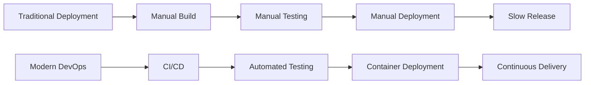

---

# 2. What is AI-Assisted DevOps?

AI-assisted DevOps uses AI tools to:

- Generate code and infrastructure
- Assist troubleshooting
- Analyze logs and incidents
- Improve deployment reliability
- Accelerate operational workflows

---

## AI-Assisted DevOps Model

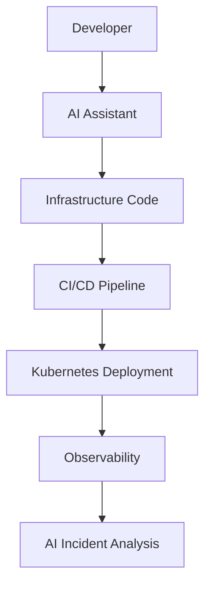

---

# 3. Application Architectures

---

## Monolithic Architecture

### Characteristics

- Single deployable application
- Shared database
- Simpler deployment

### Recommended Stack

- Java / Spring Boot
- PostgreSQL
- Docker
- GitHub Actions

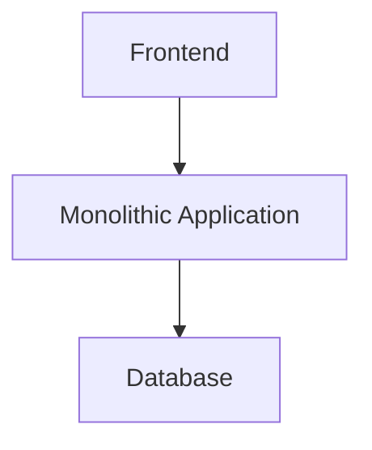

---

## Layered / N-Tier Architecture

### Characteristics

- Separation of concerns
- Enterprise-friendly
- Structured applications

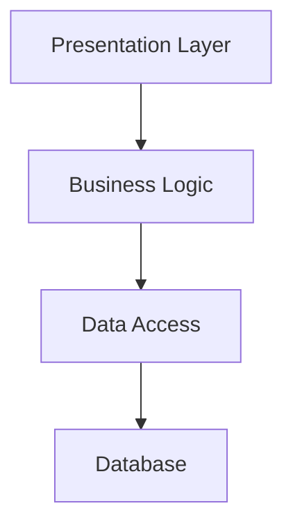

---

## Microservices Architecture

### Characteristics

- Independent services
- Independent deployment
- Scalable
- Kubernetes-friendly

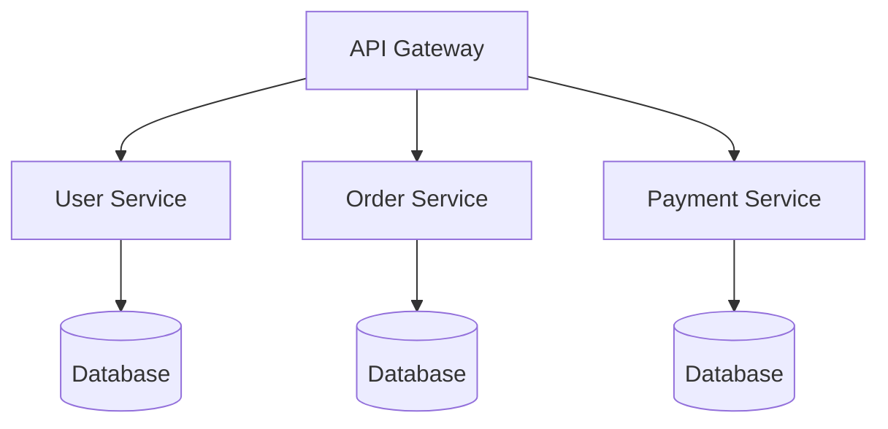

---

## Event-Driven Architecture

### Characteristics

- Asynchronous communication
- Kafka-based streaming
- Decoupled systems

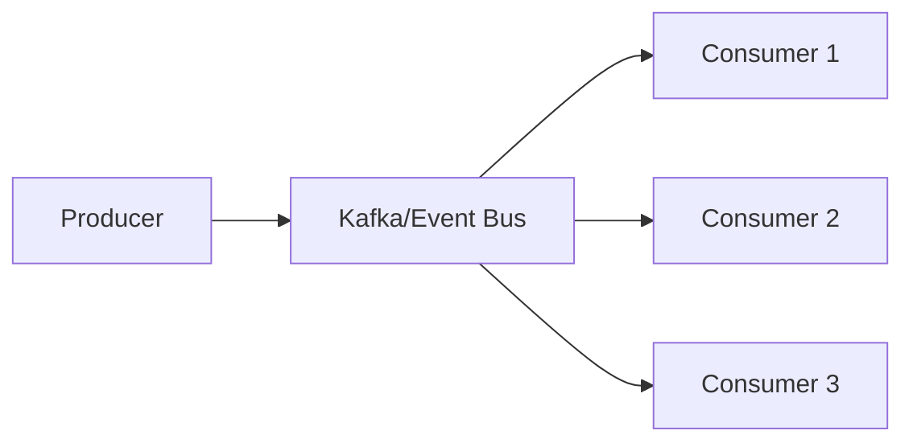

---

## Cloud-Native Architecture

### Characteristics

- Kubernetes
- GitOps
- IaC
- Observability
- Service Mesh

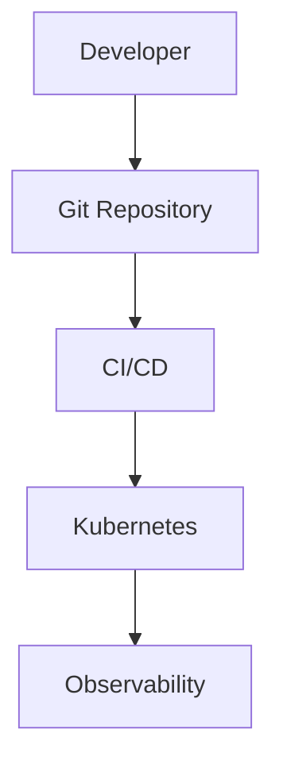

---

# 4. Technology Stack Decision Criteria

---

## Important Decision Factors

| Factor | Impact |
|---|---|
| Scale | Determines architecture complexity |
| Latency | Impacts language and networking |
| Team Skills | Determines operational capability |
| Operational Maturity | Determines Kubernetes readiness |
| Compliance | Influences governance and security |
| Cloud Strategy | Influences deployment platform |
| Business Domain | Determines resilience and consistency requirements |

---

## Decision Flow

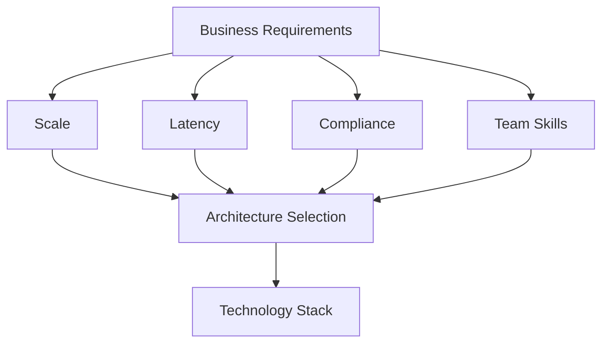

---

# 5. Modern DevOps Lifecycle

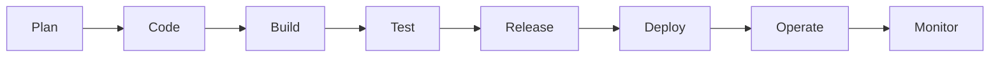

---

# 6. Containers and Kubernetes

---

## Docker

### Purpose

- Package applications consistently
- Simplify deployment portability
- Improve scalability

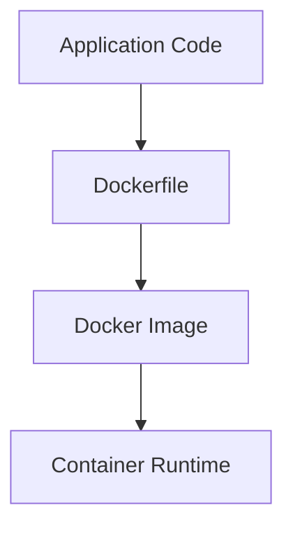

---

## Kubernetes

### Core Components

| Component | Purpose |
|---|---|
| Pod | Smallest deployment unit |
| Deployment | Scaling and updates |
| Service | Networking |
| Ingress | External traffic |
| ConfigMap | Configuration |
| Secret | Credentials |

---

## Kubernetes Deployment Model

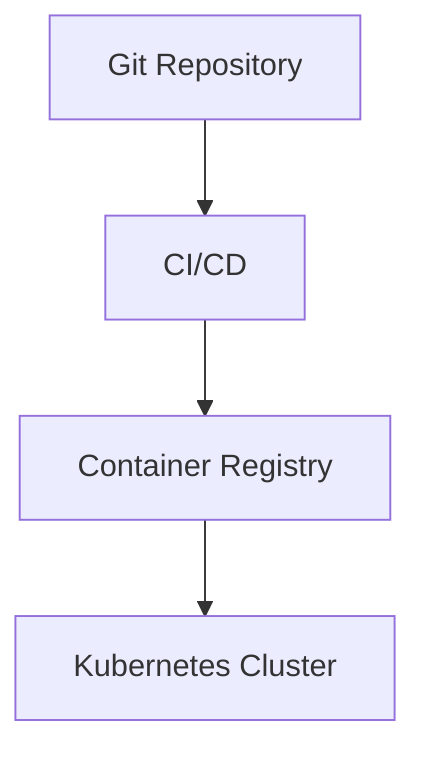

---

# 7. Infrastructure as Code (IaC)

---

## What is IaC?

Infrastructure managed as code.

Benefits:

- Repeatability
- Version control
- Automation
- Consistency

---

## Terraform Workflow

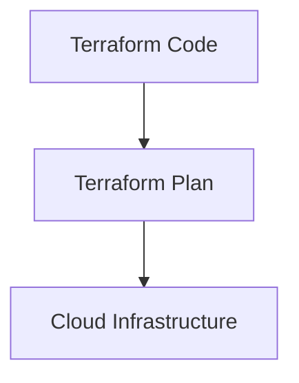

---

# 8. CI/CD and GitOps

---

## CI/CD Pipeline

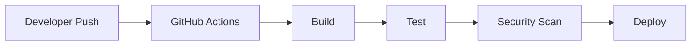

---

## GitOps Deployment

### Tools

- Argo CD
- Flux CD

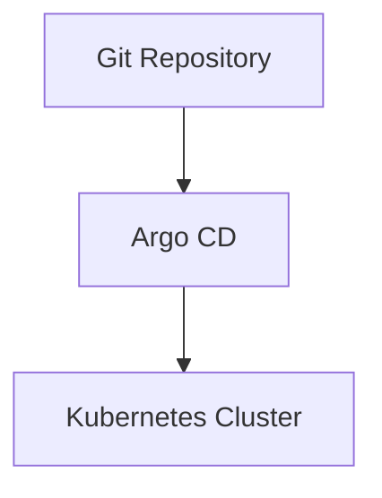

---

# 9. AI-Assisted DevOps Tools

---

## Recommended AI Tools

| Tool | Purpose |
|---|---|
| GitHub Copilot | Code and IaC generation |
| Claude | Architecture review and debugging |
| Cursor | Repository-wide AI assistance |
| K8sgpt | Kubernetes diagnostics |
| Harness AI | Deployment verification |
| Datadog AI | Observability and RCA |
| PagerDuty AI | Incident management |

---

## AI Tooling Workflow

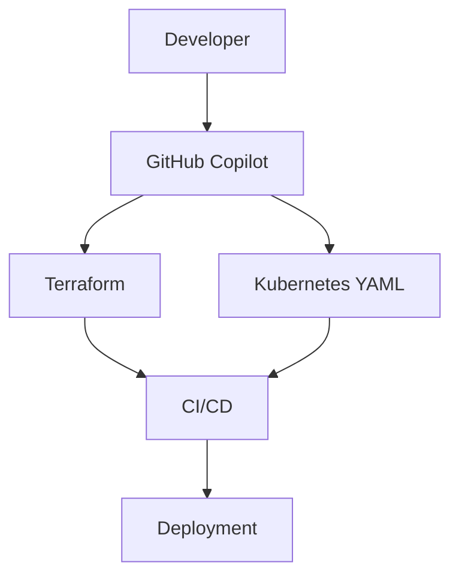

---

# 10. Observability and AIOps

---

## Observability Stack

| Area | Tool |
|---|---|
| Metrics | Prometheus |
| Dashboards | Grafana |
| Logs | Loki |
| Tracing | Jaeger |
| APM | Datadog |
| AI RCA | Dynatrace AI |

---

## AIOps Flow

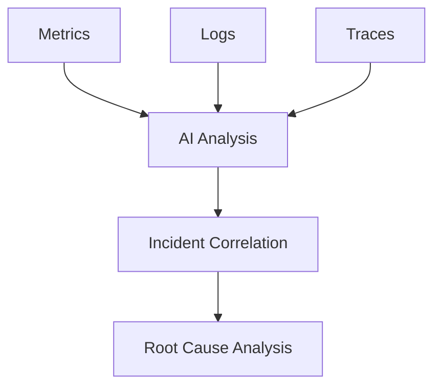

---

# 11. Security and DevSecOps

---

## DevSecOps Principles

- Shift security left
- Automate security validation
- Scan continuously
- Enforce least privilege

---

## Recommended Security Tools

| Tool | Purpose |
|---|---|
| Snyk | Dependency scanning |
| Semgrep | Static analysis |
| CodeQL | GitHub-native security |
| Vault | Secrets management |
| OPA | Policy-as-Code |

---

## DevSecOps Pipeline

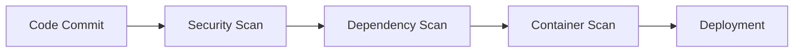

---

# 12. End-to-End AI-Assisted Deployment Workflow

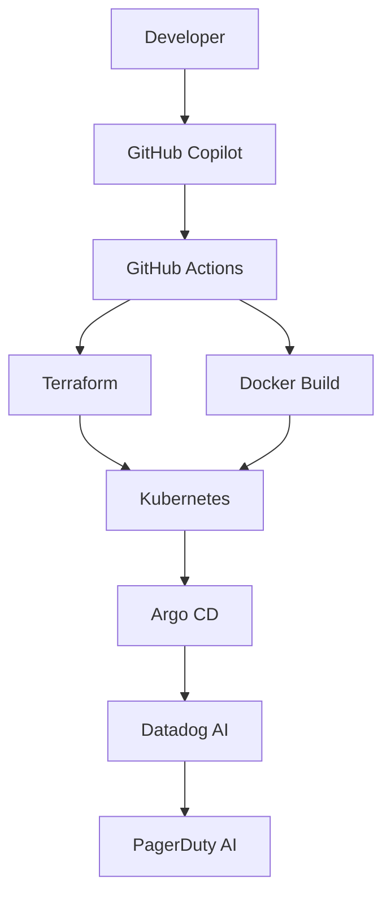

---

# 13. Learning Path from Ground Zero

---

## Recommended Learning Roadmap

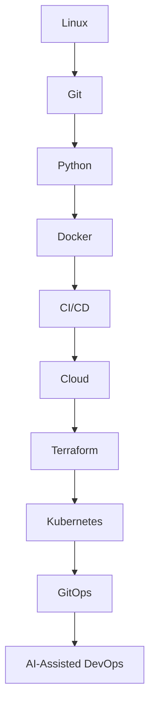

---

## Recommended Beginner Stack

| Area | Recommended |
|---|---|
| OS | Ubuntu |
| Programming | Python |
| SCM | GitHub |
| CI/CD | GitHub Actions |
| Containers | Docker |
| Cloud | AWS |
| IaC | Terraform |
| Orchestration | Kubernetes |
| Observability | Grafana |
| AI Assistant | GitHub Copilot |

---

# 14. Strategic Recommendations

---

## Important Principles

### 1. Start Simple

Avoid overengineering early.

### 2. Build Operational Capability

Operational maturity matters more than architectural elegance.

### 3. Use AI as an Accelerator

AI improves productivity but does not replace engineering fundamentals.

### 4. Adopt GitOps and IaC

Modern infrastructure should be declarative and automated.

### 5. Maintain Human Governance

Human review remains critical for:

- security,
- compliance,
- and production reliability.

---

# Final Summary

Modern AI-assisted DevOps combines:

- Cloud-native platforms
- CI/CD automation
- Kubernetes orchestration
- Infrastructure as Code
- GitOps
- Observability
- AI-assisted operations

The future direction:

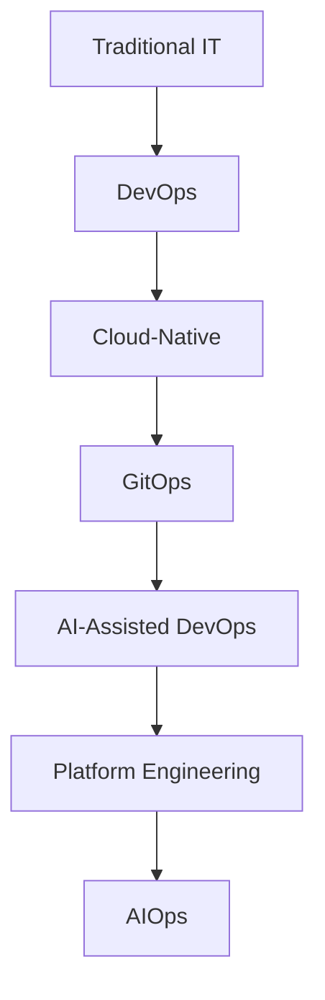

---

# End of Teaching Notes
