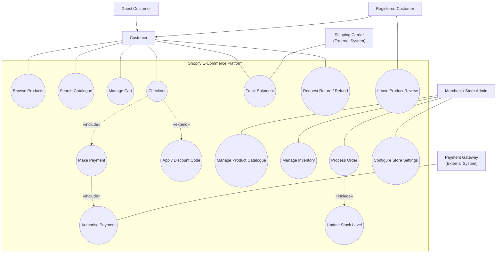
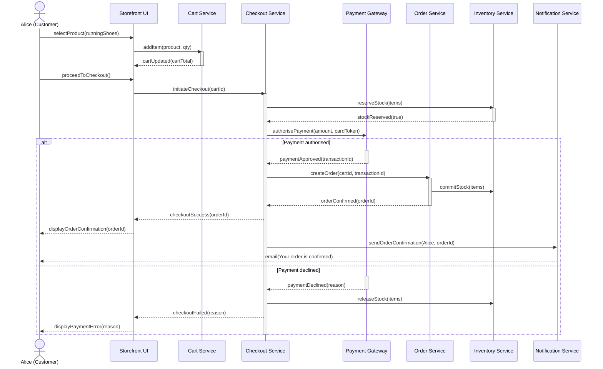
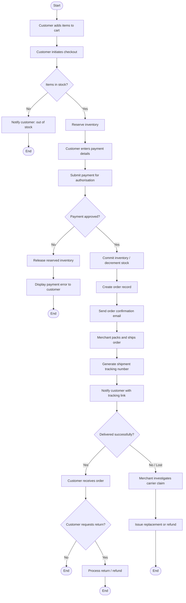
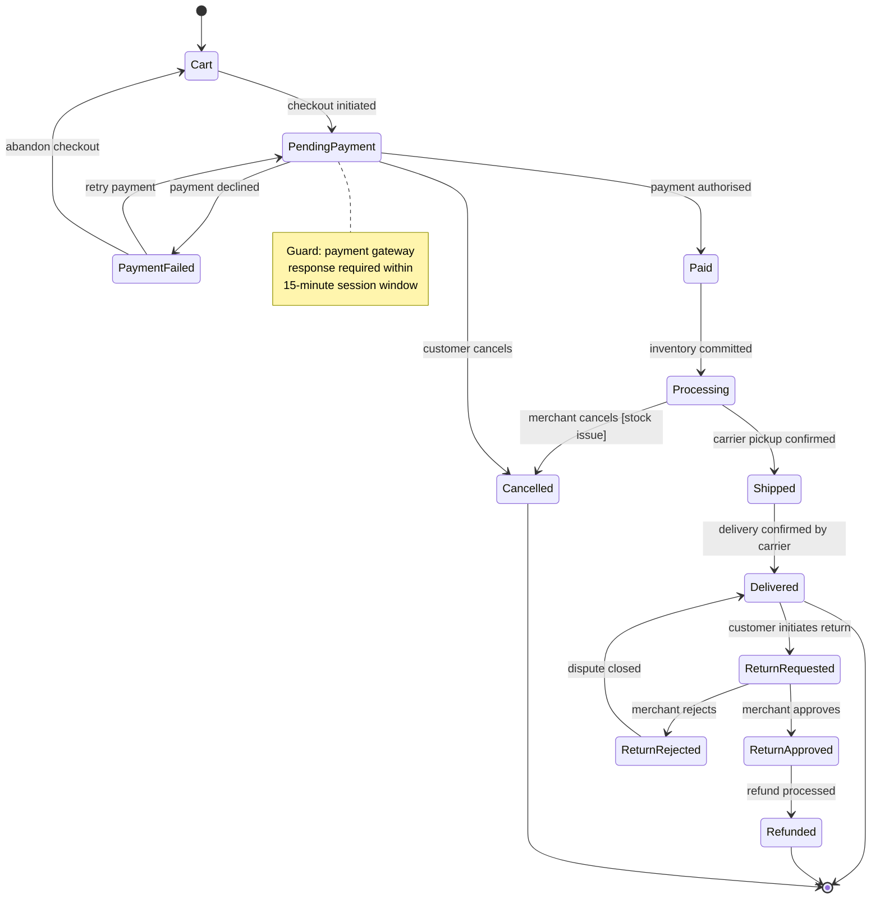
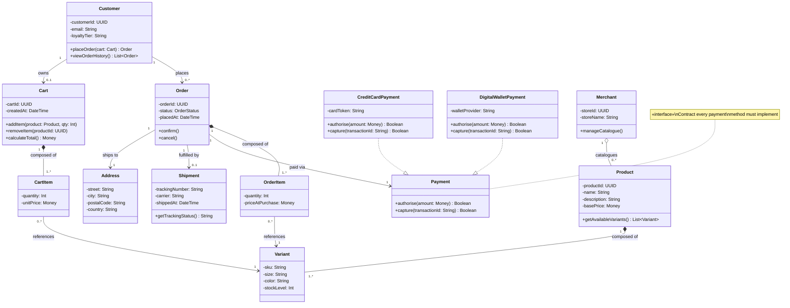
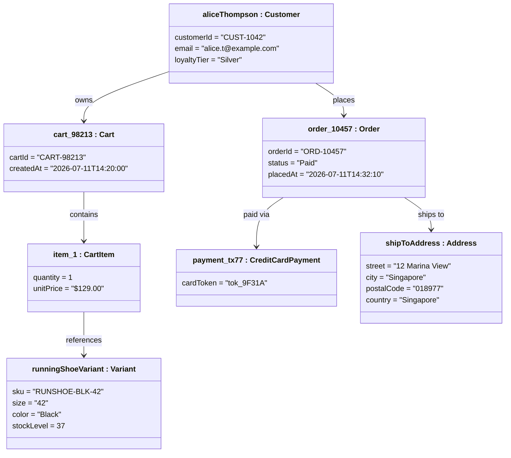
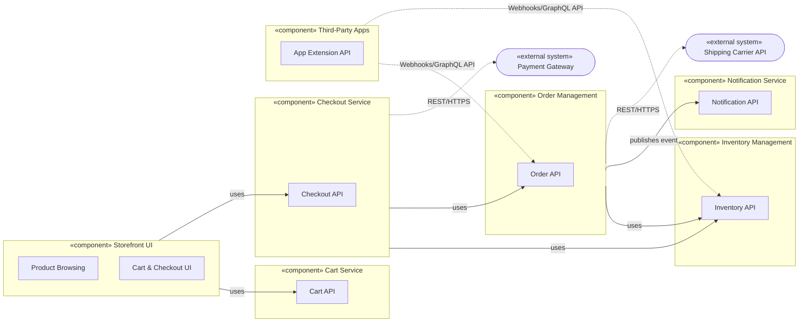
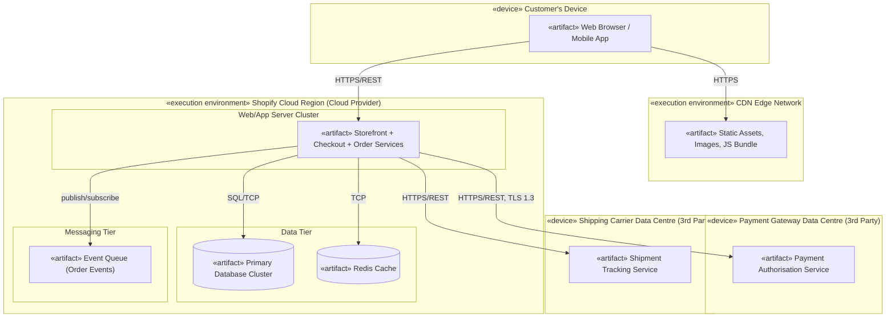
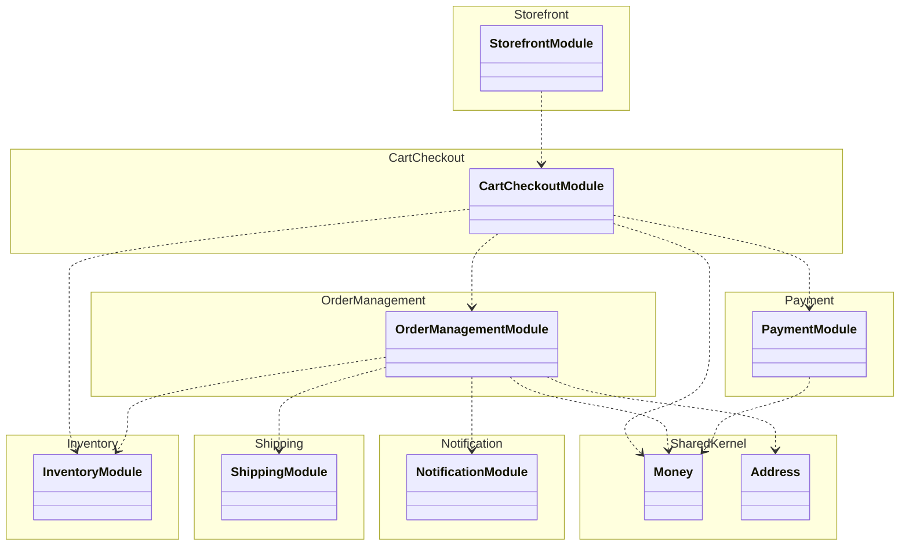

# UML in Practice: An End-to-End Shopify Case Study

**Audience:** University-level Information & Communication Technology students
**Purpose:** Teach the nine core UML diagram types through one continuous, realistic e-commerce storyline
**Tooling:** All diagrams are authored in [Mermaid](https://mermaid.js.org/) syntax and render directly in any Mermaid-compatible Markdown viewer (GitHub, GitLab, VS Code with the Mermaid extension, Obsidian, or the Mermaid Live Editor)

> **Trademark note:** "Shopify" is a registered trademark of Shopify Inc. This document uses Shopify solely as a publicly recognisable example of a real-world e-commerce platform for educational, non-commercial teaching purposes. Diagrams are original interpretations of a generic e-commerce architecture and are not derived from Shopify's proprietary source code, internal design documents, or confidential materials.

---

## 1. The Recurring Storyline

To help students see how the *same system* looks different depending on which UML "lens" you use, every diagram in this guide traces one consistent scenario:

> **Scenario: "Alice buys a pair of running shoes on a Shopify storefront."**
> Alice searches the store, adds a product to her cart, checks out, pays by credit card via a payment gateway, the merchant's inventory is decremented, the order is fulfilled and shipped, and Alice later tracks and receives her delivery. A secondary thread covers what happens when payment fails, and what happens if Alice later requests a return.

Keeping the scenario constant lets you teach a powerful idea: **UML diagrams are complementary views of one system, not eight unrelated exercises.** Use case diagrams show *what* the system does; sequence and activity diagrams show *how* behaviour unfolds over time; state diagrams show *what an object goes through*; class, object, component, and deployment diagrams show *structure* at increasing levels of concreteness (logical → instance → software → physical).

| Diagram | UML Category | Question it Answers |
|---|---|---|
| Use Case | Behavioural | Who uses the system, and for what? |
| Sequence | Behavioural (interaction) | In what order do objects exchange messages for one scenario? |
| Activity | Behavioural | What is the workflow/control flow, including decisions and parallelism? |
| State Machine | Behavioural | What states can one object be in, and what triggers transitions? |
| Class | Structural | What are the types in the domain and how do they relate? |
| Object | Structural (instance) | What do actual instances and their links look like at one moment? |
| Component | Structural | How is the software decomposed into replaceable units and interfaces? |
| Deployment | Structural (physical) | Where does the software run, on what hardware/nodes, over what protocols? |
| Package | Structural (organisational) | How is the codebase grouped into modules, and who owns what? |

---

## 2. Use Case Diagram — "Who does what on the storefront?"

### 2.1 Notation covered
Actors (primary and external systems), use cases (ovals), system boundary, `<<include>>` (mandatory sub-behaviour) and `<<extend>>` (optional/conditional behaviour), and generalisation between actors.

### 2.2 Teaching notes
- Point out that **Guest Customer** and **Registered Customer** generalise **Customer** — an actor generalisation, distinct from use-case generalisation.
- **Apply Discount Code** is modelled with `<<extend>>` from Checkout because it is optional and conditional (only if the customer has a code); **Make Payment** is `<<include>>` because checkout cannot complete without it.
- **Payment Gateway** and **Shipping Carrier** are external system actors, not human actors — a common student misconception is that actors must be people.
- The system boundary box matters: it separates what the *Shopify platform* is responsible for from what external actors (banks, carriers) do.

### 2.3 Student exercise
Redraw the diagram to add a **"Subscribe to Back-in-Stock Alert"** use case. Decide: is it `<<extend>>` of Browse Products, or a standalone use case? Justify your choice in two sentences, and identify which actor(s) trigger it.

---

## 3. Sequence Diagram — "How does checkout actually happen?"

### 3.1 Notation covered
Lifelines, synchronous messages (solid arrow, filled head), asynchronous messages (open head), return messages (dashed), `alt`/`else` combined fragment for conditional branching, and activation bars.

### 3.2 Teaching notes
- Emphasise the difference between **reserving** stock (soft hold during payment) and **committing** stock (permanent decrement after payment success) — a real inventory-integrity pattern worth discussing.
- The `alt`/`else` fragment is the sequence-diagram equivalent of the decision diamond students will see next in the Activity Diagram — a good bridge between the two notations.
- Ask students to identify which messages are synchronous (the caller waits, e.g. `authorisePayment`) versus which could plausibly be asynchronous in a real system (e.g. `sendOrderConfirmation`, which does not block checkout completion).

### 3.3 Student exercise
Extend the diagram with a new participant, **Fraud Detection Service**, inserted between Checkout and Payment. Model a scenario where a transaction is flagged as suspicious and checkout is held pending manual review, rather than immediately approved or declined.

---

## 4. Activity Diagram — "What is the end-to-end order workflow?"

### 4.1 Notation covered
Initial/final nodes, actions, decision/merge diamonds, and (via subgraphs, since Mermaid's flowchart engine is used to express UML activity semantics) informal swimlanes by responsibility.

### 4.2 Teaching notes
- This is a good diagram to contrast against the Sequence Diagram: the Activity Diagram deliberately **hides which object performs each action** and focuses purely on control flow, while the Sequence Diagram deliberately **hides the branching logic** and focuses on object interaction order.
- Multiple end nodes are valid UML — make sure students understand a flow can terminate in more than one place, each representing a distinct outcome.
- Ask which actions could run **in parallel** using fork/join bars (e.g., "send confirmation email" and "notify warehouse" could fork from the same point) — a natural extension exercise using Mermaid's ability to branch to multiple nodes from one source.

### 4.3 Student exercise
Redraw the section from "Commit inventory" onward using explicit **fork and join** notation to show that "send order confirmation email" and "notify warehouse for packing" happen concurrently, then rejoin before "Merchant packs and ships order."

---

## 5. State Machine Diagram — "What states can an Order be in?"

### 5.1 Notation covered
Initial pseudostate, states, guarded transitions, self-transitions, and a final state. This models the *Order* object's lifecycle, not the whole system.

### 5.2 Teaching notes
- Distinguish this from the Activity Diagram: the state diagram belongs to **one class (Order)** and describes its lifecycle regardless of *who* causes each transition, whereas the activity diagram described the *whole business process* across multiple objects.
- Highlight the guard condition in the note — a common exam point is that transitions can carry guard conditions in square brackets, e.g. `Processing --> Cancelled: merchant cancels [stock issue]`.
- Good discussion prompt: why are there **two paths back from PaymentFailed** (retry vs. abandon)? This demonstrates that a state can have multiple valid outgoing transitions triggered by different events.

### 5.3 Student exercise
Add a **"PartiallyShipped"** state to handle an order with multiple line items shipped in separate parcels. Decide which existing transitions need to be rerouted through it, and write the guard condition in words.

---

## 6. Class Diagram — "What is the domain model?"

### 6.1 Notation covered
Classes with attributes/operations and visibility markers, multiplicities, association, aggregation (hollow diamond), composition (filled diamond), inheritance, and interface realisation.

### 6.2 Teaching notes
- Use this diagram to contrast **composition vs. aggregation**: `Cart *-- CartItem` is composition because a cart item cannot exist without its cart, whereas `Merchant o-- Product` is aggregation because a product could conceivably be reassigned or exported independently of one merchant record.
- `Payment` as an interface realised by `CreditCardPayment` and `DigitalWalletPayment` is a direct, concrete example of the **Strategy Pattern** — worth connecting to a design patterns lecture if your syllabus covers it. The interface is marked with a note rather than a `<<interface>>` stereotype block, since several current Mermaid renderers still mis-parse a stereotyped class that also appears in a realization relationship — a known renderer quirk worth flagging to students if they try the stereotype form themselves and hit a parse error.
- Multiplicities are the most common source of student error — walk through `Order "1" *-- "1..*" OrderItem` explicitly: one order is composed of *one or more* order items, and each order item belongs to *exactly one* order (the composition already implies the "1" side).

### 6.3 Student exercise
Add a `Discount` class applied to either a `Cart` or an individual `CartItem`. Decide the multiplicity and whether the relationship should be association or aggregation, and justify it in one sentence.

---

## 7. Object Diagram — "What does one real checkout look like at 14:32 on Order #10457?"

### 7.1 Notation covered
An object diagram is a **snapshot of instances and links** at one moment in time — the instance-level counterpart to the class diagram above. Object names are written `instanceName : ClassName`.

### 7.2 Teaching notes
- This is the diagram most students confuse with the class diagram — stress that **every value here is concrete and real** (an actual token, an actual stock count of 37), whereas the class diagram described *types and rules*, not specific data.
- A good in-class question: "Why is there no `OrderItem` linking Order directly to Variant in this snapshot the way the class diagram implied?" — the honest answer is this snapshot only shows the objects relevant to illustrate the linkage pattern; a complete object diagram would include `orderItem_1 : OrderItem` mirroring `item1`.
- Note that Mermaid has no dedicated object-diagram syntax; the `class alias["objectName : Type"]` bracket-label trick above is a widely used, pragmatic workaround worth explaining to students so they are not confused when reading the raw Mermaid source. The short identifier before the brackets (e.g. `alice`, `cart`) is only the internal reference used for drawing links — the label in brackets is what actually renders on the diagram.

### 7.3 Student exercise
Draw the object diagram for the moment **immediately after Alice's payment is declined** instead of approved. Which objects still exist? Which attribute values change? Does the `order` object exist at all at that point, given the state diagram in Section 5?

---

## 8. Component Diagram — "How is the Shopify-like system decomposed into software units?"

### 8.1 Notation covered
Components (`<<component>>` stereotype), provided/required interfaces, and dependency relationships between components. Mermaid has no native UML component-diagram type, so this uses `flowchart` with subgraphs and stereotype labels — a standard, widely taught workaround.

### 8.2 Teaching notes
- Emphasise **interfaces over implementation**: a component diagram tells you *what a unit exposes and depends on*, not its internal classes — that was the job of the class diagram.
- The **Third-Party Apps** component is a great real-world talking point: Shopify's actual app ecosystem works exactly this way, through public REST/GraphQL APIs and webhooks, without third parties touching internal services directly. This is a good moment to discuss the **Facade** and **API Gateway** patterns.
- Ask students to identify which dependencies represent **synchronous request/response** (solid, "uses") versus **asynchronous/event-driven** (dashed, "publishes event") integration, and why that choice matters for system resilience.

### 8.3 Student exercise
Add a new component, **Recommendation Engine**, that reads from Order Management and Inventory Management to suggest related products back to the Storefront UI. Decide whether its dependency on those two components should be synchronous or event-driven, and justify your choice.

---

## 9. Deployment Diagram — "Where does all of this actually run?"

### 9.1 Notation covered
Nodes (physical or virtual execution environments, `<<device>>` / `<<execution environment>>`), artifacts deployed on nodes, and communication paths labelled with protocols. Mermaid again has no native deployment-diagram type, so nodes are modelled as subgraphs.

### 9.2 Teaching notes
- Distinguish **node** (where software runs — a server, container, or device) from **artifact** (the deployable software unit itself, e.g., a compiled service or database file) — a frequent point of confusion with the earlier Component Diagram.
- This diagram is where **security and DevSecOps conversations naturally belong**: ask students what should happen at each `HTTPS`/`TLS` boundary (e.g., mutual TLS to the payment gateway, network segmentation between the web tier and data tier, secrets management for API keys to the shipping carrier).
- Connect back to the Component Diagram: every component in Section 8 must be deployed onto some node here. A useful exam-style question is "trace the Checkout Service component from Section 8 to the node it runs on here, and identify every network hop involved in one checkout."

### 9.3 Student exercise
Redraw the Data Tier to show a **primary-replica database setup** (one write node, two read replicas) and update the diagram to show which artifact(s) connect to the primary versus the replicas. Briefly explain the availability benefit this gives Shopify's storefront under high traffic (e.g., flash sales).

---

## 10. Package Diagram — "How should the codebase be organised so Agile teams can move independently?"

### 10.1 Why this diagram was added
The first nine sections covered eight of UML's fourteen diagram types. Of the remaining ones (Package, Composite Structure, Profile, Communication, Timing, Interaction Overview), the **Package Diagram** is the one most worth adding for a course that touches Agile and DevSecOps practice. Class, Component, and Deployment diagrams show *what the system is made of* and *where it runs*, but none of them answer a question every Agile/DevOps team has to answer on day one: **how do we slice this codebase so separate squads can build, test, and deploy their slice independently, without stepping on each other every sprint?** That is exactly what a Package Diagram is for — grouping model elements into named packages (modules, services, or bounded contexts) and showing the *dependency* relationships between them. It is the diagram most directly tied to Conway's Law, team topology decisions, and monolith-to-microservices migration planning.

### 10.2 Notation covered
Packages (folder-tabbed containers) grouping related classes, and dependency relationships (`..>`, dashed arrow) between packages showing which module relies on which. Mermaid has no dedicated package-diagram type, but its `classDiagram` **`namespace`** block is the built-in, native way to group classes into a labelled container — the closest first-class equivalent Mermaid offers to a UML package, so no flowchart workaround is needed here.

### 10.3 Teaching notes
- Map each package directly onto an **Agile squad or "two-pizza team"**: Storefront, Cart & Checkout, Order Management, Inventory, Payment, Shipping, and Notification could each be owned by a separate team with its own backlog, sprint cadence, and CI/CD pipeline. This is the diagram to introduce **Conway's Law** ("organisations design systems that mirror their own communication structure") — ask students whether the package boundaries above should be drawn to match an org chart, or whether the org chart should be redrawn to match good package boundaries.
- Point out the **`SharedKernel`** package (a Domain-Driven Design term worth introducing here): `Money` and `Address` are used by several packages. In Agile practice, shared kernels are a known source of cross-team coordination overhead — every change to `Money` potentially requires sign-off from three teams. Ask students whether `SharedKernel` should be frozen, versioned as a published library, or eliminated by duplicating small value objects per package.
- This is the diagram to discuss **acyclic dependencies as a release-planning constraint**: if `OrderManagementModule` depended back on `CartCheckoutModule`, the two teams could never deploy independently — a circular package dependency is a leading indicator that a "two-week sprint" will quietly become a "two-team sprint."
- Connect back to Section 8 (Component Diagram) and Section 9 (Deployment Diagram): a package here is typically what becomes one deployable component there, and packages with the fewest incoming dependencies from other teams are usually the safest candidates to extract first if the organisation later decides to move from a modular monolith to microservices.

### 10.4 Student exercise
`CartCheckoutModule` currently depends directly on `OrderManagementModule`. Redraw this relationship using an **event-driven, dependency-inverted design** (e.g., Cart & Checkout publishes an "OrderRequested" event that Order Management subscribes to, rather than calling it directly). Explain in two or three sentences why this change would let the Cart & Checkout team and the Order Management team ship on independent release schedules.

---

## 11. Suggested Classroom Sequence

1. Start with the **Use Case Diagram** to establish scope and actors.
2. Move to **Sequence** then **Activity** diagrams to build behavioural intuition — sequence first (object-centric), activity second (workflow-centric), explicitly contrasting the two.
3. Introduce the **State Machine Diagram** once students have seen "Paid," "Processing," etc. appear informally in the sequence/activity diagrams — this makes the state diagram feel like a natural formalisation rather than a new topic.
4. Teach **Class Diagram** as the structural backbone, then immediately follow with **Object Diagram** as its instance-level counterpart — this pairing is the fastest way to fix the "class vs. object" misconception.
5. Close with **Component**, **Deployment**, and **Package** diagrams together, since they represent the same system at increasing levels of organisational and physical concreteness (logical software units → physical/execution placement → team/module ownership), and it is where architecture, DevSecOps, and Agile team-topology discussions fit naturally.

## 12. Recommendations and Points You May Want to Cover Next

A few adjacent topics come up naturally once this material is taught, and you may want to fold them in depending on course depth:

- **Keeping diagrams and code in sync.** If your students later implement any part of this domain model in code, consider requiring that Mermaid diagrams live in the same repository as the code and are updated in the same pull request as any schema or API change — this mirrors the "docs-as-code" and diagram-sync practice used in professional DevSecOps workflows.
- **Round-trip validation.** For the Class Diagram in particular, some tools (e.g., PlantUML with plugins, or Mermaid-to-code generators) can validate that a class diagram and an actual codebase's types have not drifted apart — a good extension topic for a more advanced module.
- **Assessment rubric.** If this guide will be used for a graded assignment, a rubric split across (a) correct UML notation/syntax, (b) fidelity to the Shopify scenario, (c) justification of modelling choices (e.g., aggregation vs. composition), and (d) one original extension per diagram tends to work well and directly maps to the "Student exercise" sections above.
- **Licensing of this material.** If you plan to redistribute this guide to students via a public repository or LMS, consider adding an explicit licence (e.g., CC BY-NC 4.0 for teaching material) and retaining the Shopify trademark disclaimer at the top, since the scenario is illustrative rather than derived from Shopify's actual internal systems.
- **Accessibility.** Mermaid diagrams render as SVG with limited built-in alt-text support; if any students use screen readers, consider supplementing each diagram with a one-paragraph plain-text description of what it shows (a draft description is effectively already provided in each section's "Notation covered" line).
- **Diagram types not covered here.** UML 2.5 defines fourteen diagram types in total; this guide covers nine of the most commonly taught ones. The five omitted are: **Composite Structure Diagram** (internal wiring of a single complex class or component — useful if you later teach hexagonal/ports-and-adapters architecture), **Profile Diagram** (defining custom stereotypes/tagged values for domain-specific modelling — mostly a graduate-level or tooling topic), and three specialised interaction diagrams — **Communication Diagram** (same information as a Sequence Diagram, laid out around object links instead of a timeline), **Timing Diagram** (state changes plotted against a strict time axis — used for embedded/real-time systems), and **Interaction Overview Diagram** (a flowchart of interaction fragments, for very large scenarios). None of these are essential for an e-commerce case study, but Composite Structure is worth a mention if a follow-on module covers microservice internals or plug-in architectures.
