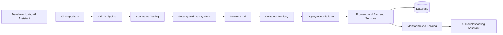
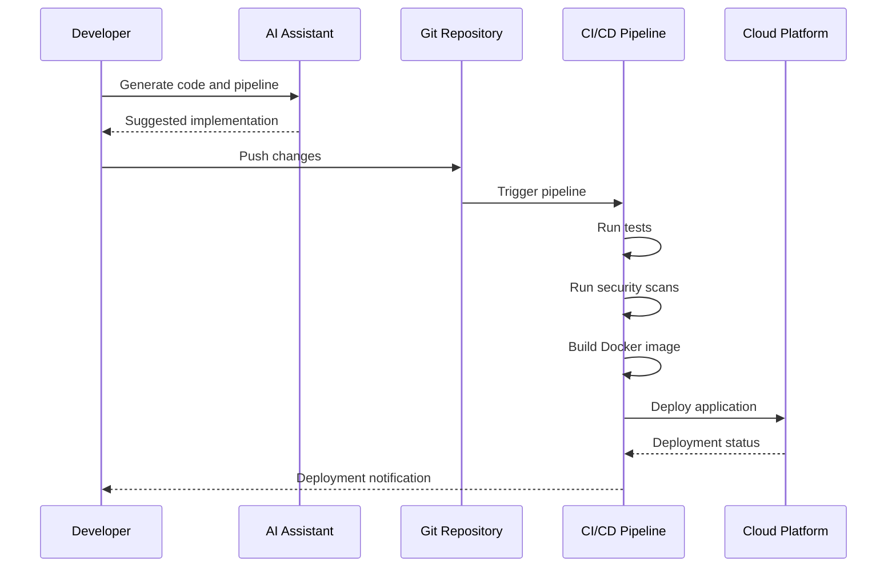
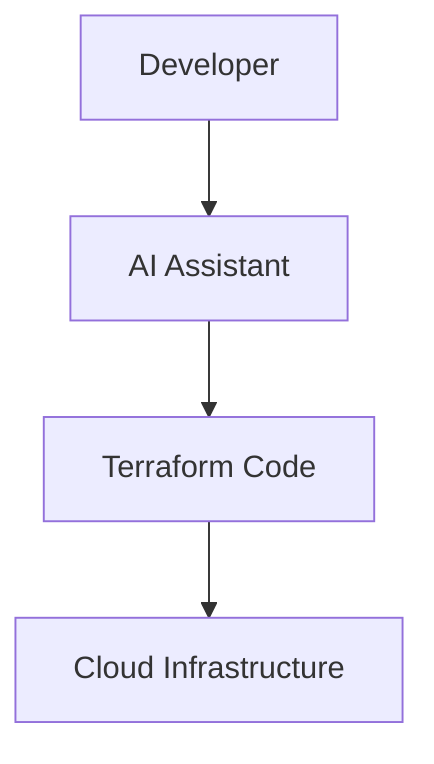
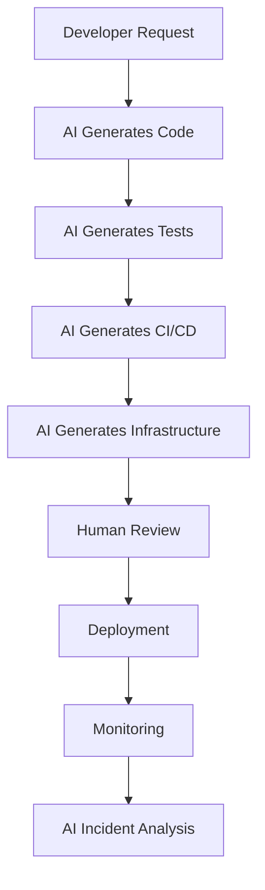
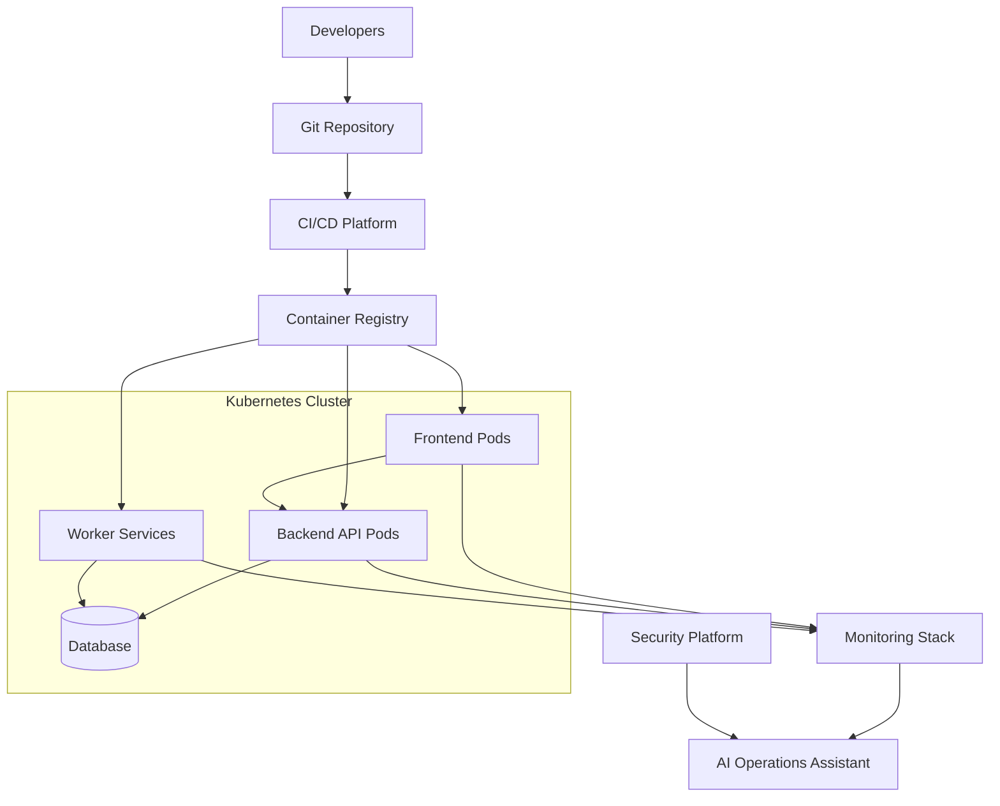

```
Prompt used:

1. ai assisted to devops and deployment in full stack
2. output the above in markdown with use of Mermaid for diagram as code
```

# AI-Assisted DevOps and Deployment for Full-Stack Applications

## Overview

AI-assisted DevOps and deployment refers to using AI tools to help automate and improve the software delivery lifecycle for full-stack systems.

This includes:

* Frontend development
* Backend services
* APIs
* Databases
* Infrastructure
* CI/CD pipelines
* Cloud deployment
* Monitoring
* Security
* Incident response

---

# Where AI Helps in Full-Stack DevOps

| Area           | AI-Assisted Capabilities                                                 |
| -------------- | ------------------------------------------------------------------------ |
| Frontend       | Generate React/Vue/Angular components, tests, accessibility improvements |
| Backend        | Generate APIs, validation logic, unit tests, refactoring                 |
| Database       | Schema design, migration generation, query optimization                  |
| CI/CD          | Generate GitHub Actions, GitLab CI, Azure DevOps pipelines               |
| Infrastructure | Generate Terraform, Kubernetes YAML, Dockerfiles                         |
| Security       | Detect vulnerabilities, explain risks, recommend fixes                   |
| Deployment     | Assist canary deployments, rolling updates, rollback strategies          |
| Monitoring     | Analyze logs, detect anomalies, summarize incidents                      |
| Documentation  | Generate runbooks, architecture diagrams, release notes                  |

---

# Recommended AI-Assisted DevOps Toolchain

| Layer                   | Recommended Tools                                                  |
| ----------------------- | ------------------------------------------------------------------ |
| AI Coding Assistant     | GitHub Copilot, Gemini Code Assist, GitLab Duo, Amazon Q Developer |
| Source Control          | GitHub, GitLab, Azure Repos                                        |
| CI/CD                   | GitHub Actions, GitLab CI/CD, Azure DevOps, Jenkins                |
| Containerization        | Docker                                                             |
| Container Orchestration | Kubernetes, Docker Compose                                         |
| Infrastructure as Code  | Terraform, Pulumi, AWS CDK                                         |
| Cloud Platforms         | AWS, Azure, Google Cloud                                           |
| Frontend Deployment     | Vercel, Netlify                                                    |
| Backend Deployment      | Render, Railway, AWS ECS, Azure App Service                        |
| Security Scanning       | Snyk, Trivy, Checkov, GitHub Advanced Security                     |
| Monitoring              | Grafana, Prometheus, Datadog, New Relic                            |
| AI Operations           | Amazon Q, Gemini Cloud Assist, Datadog AI                          |

---

# High-Level Full-Stack AI-Assisted DevOps Architecture



---

# Example Full-Stack Deployment Pipeline

## Frontend

* React / Vue / Angular
* Hosted on:

  * Vercel
  * Netlify
  * AWS S3 + CloudFront

## Backend

* Node.js / Python / Java / .NET
* Containerized using Docker
* Deployed using:

  * Kubernetes
  * AWS ECS
  * Azure App Service

## Database

* PostgreSQL
* MySQL
* MongoDB

## CI/CD

* GitHub Actions
* GitLab CI/CD
* Azure DevOps

---

# Example AI-Assisted CI/CD Workflow



---

# AI-Assisted Infrastructure as Code

## Example Terraform Workflow



AI can help generate:

* Terraform modules
* Kubernetes manifests
* Helm charts
* Networking configurations
* IAM policies
* Monitoring configurations

---

# Recommended Starting Point from Ground Zero

## Phase 1 — Foundation

### Learn

* Git
* Linux basics
* Docker fundamentals
* Cloud basics

### Tools

* GitHub
* GitHub Copilot
* Docker Desktop

---

## Phase 2 — CI/CD

### Learn

* GitHub Actions
* Automated testing
* Branching strategy

### Build

* Automatic testing pipeline
* Automatic deployment pipeline

---

## Phase 3 — Cloud Deployment

### Learn

* Kubernetes basics
* Infrastructure as Code
* Cloud networking

### Build

* Dockerized applications
* Kubernetes deployments
* Terraform infrastructure

---

## Phase 4 — Production Operations

### Learn

* Monitoring
* Logging
* Security
* Incident response

### Add

* Grafana
* Prometheus
* Datadog
* Snyk
* Trivy

---

# AI-Assisted DevOps Workflow



---

# Practical AI Prompts for DevOps

## Docker

```text
Generate a production-ready Dockerfile for a Node.js API using multi-stage builds.
```

## CI/CD

```text
Create a GitHub Actions workflow to:
- run tests
- scan vulnerabilities
- build Docker image
- deploy to Kubernetes
```

## Kubernetes

```text
Generate Kubernetes manifests for:
- frontend deployment
- backend API
- ingress controller
- autoscaling
```

## Security

```text
Review this Terraform code for security risks and compliance issues.
```

## Monitoring

```text
Analyze these application logs and identify the root cause of deployment failure.
```

---

# Benefits of AI-Assisted DevOps

| Benefit                | Description                        |
| ---------------------- | ---------------------------------- |
| Faster Delivery        | Reduced manual work                |
| Better Automation      | Easier CI/CD setup                 |
| Improved Consistency   | Standardized configurations        |
| Faster Troubleshooting | AI log analysis                    |
| Better Documentation   | Automatic documentation generation |
| Faster Learning        | Junior engineers ramp faster       |

---

# Risks and Downsides

| Risk                     | Description                                    |
| ------------------------ | ---------------------------------------------- |
| Incorrect Configurations | AI-generated configs may be insecure           |
| Over-Reliance            | Teams may stop understanding systems deeply    |
| Security Risks           | AI may suggest unsafe defaults                 |
| Operational Complexity   | More automation can increase hidden complexity |
| Hallucinations           | AI may generate invalid infrastructure code    |
| Compliance Issues        | Generated configurations may violate policies  |

---

# Recommended Best Practices

## Always

* Review AI-generated infrastructure code
* Review deployment scripts
* Validate security configurations
* Use automated testing
* Use staging environments
* Apply least privilege principles

## Never

* Deploy AI-generated code directly to production without review
* Store secrets in code repositories
* Assume AI-generated infrastructure is secure by default

---

# Recommended Full-Stack Architecture by Scale

| Scale         | Recommended Stack                              |
| ------------- | ---------------------------------------------- |
| Small Startup | Vercel + Railway + PostgreSQL                  |
| Medium SaaS   | Kubernetes + Terraform + GitHub Actions        |
| Enterprise    | Multi-cloud Kubernetes + GitOps + Service Mesh |

---

# Example Enterprise DevOps Architecture



---

# Final Recommendation

Use AI as:

* A productivity accelerator
* A DevOps assistant
* A deployment advisor
* A troubleshooting companion

But maintain:

* Human review
* Security governance
* Operational discipline
* Infrastructure knowledge
* Observability
* Testing rigor

AI should augment engineering capability, not replace engineering judgment.
