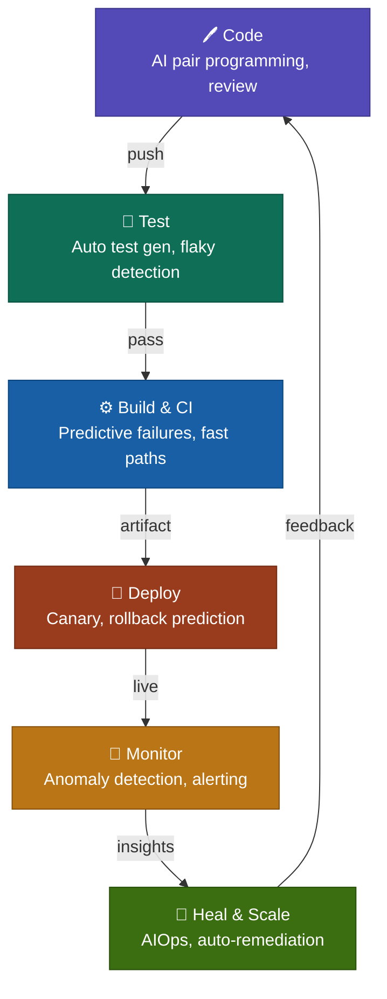
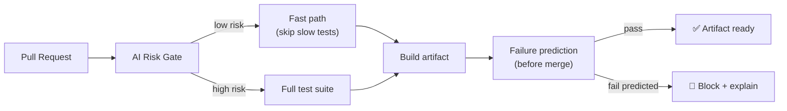
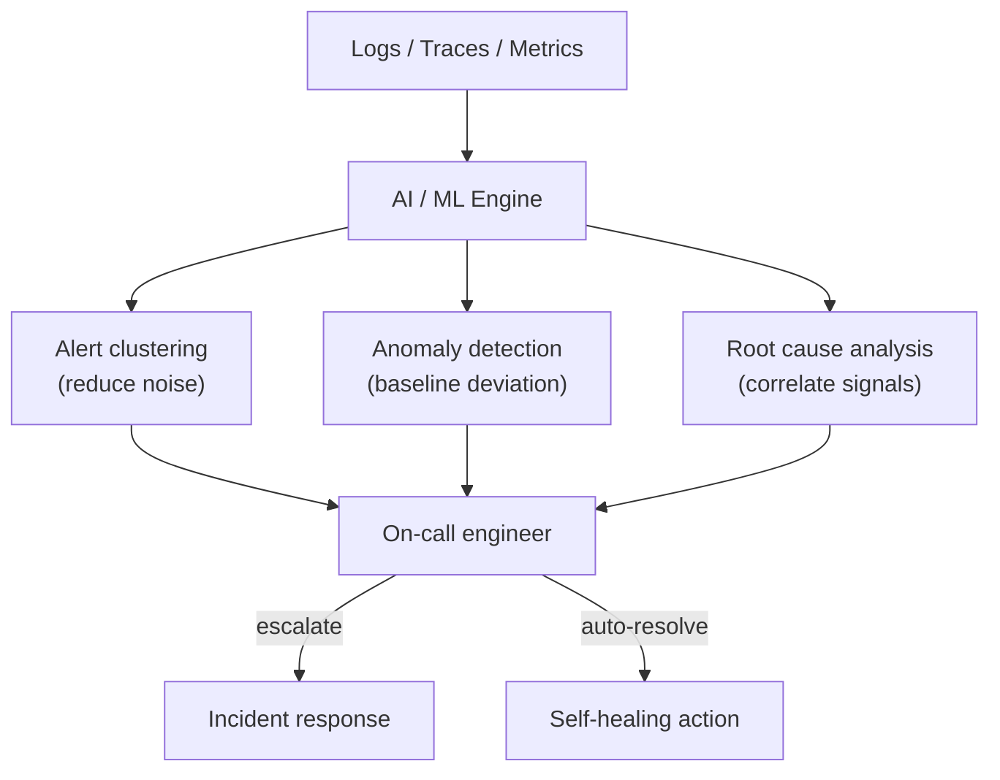

```
Prompt used:

1. ai assisted to devops and deployment in full stack
2. output the above in markdown with use of Mermaid for diagram as code
```

# AI-Assisted DevOps & Deployment in Full-Stack Development

AI is reshaping every layer of the DevOps lifecycle — from the moment a developer writes a line of code to the moment a production incident is resolved. This document maps out each stage, the AI capabilities unlocked at that stage, and the tools leading the charge.

---

## Pipeline Overview



---

## Stage 1 — Code

AI reduces the distance between intent and working code.

**What AI does here:**
- Provides inline completions and multi-line suggestions as you type
- Reviews pull requests for bugs, security issues, and style violations
- Generates docstrings, commit messages, and changelogs automatically
- Explains unfamiliar code and suggests refactors

**Tools:** GitHub Copilot, Cursor, Claude Code, Amazon CodeWhisperer, Tabnine

---

## Stage 2 — Test

AI closes the testing gap that slows down every team.

**What AI does here:**
- Generates unit and integration tests from source code with no manual effort
- Detects flaky tests and quarantines them automatically
- Identifies untested code paths and suggests coverage improvements
- Self-heals broken tests when the implementation changes

**Tools:** CodiumAI, Diffblue Cover, TestSigma, Applitools (visual testing)

---

## Stage 3 — Build & CI

AI turns the CI pipeline from a passive runner into an active optimizer.



**What AI does here:**
- Predicts build failures before they run using historical signal
- Selects only the tests impacted by a given change (test impact analysis)
- Optimises Docker layer caching and parallel job scheduling
- Explains why a build failed in plain language

**Tools:** Gradle Enterprise, Bazel Remote Cache, Harness CI, BuildPulse

---

## Stage 4 — Deploy

AI makes deployment a data-driven decision, not a leap of faith.

**What AI does here:**
- Scores deployment risk using metrics, error rates, and historical patterns
- Manages traffic shifting for canary and blue-green releases automatically
- Triggers automatic rollback when SLO thresholds are breached
- Generates deployment summaries and change impact reports

**Tools:** Harness CD, Argo Rollouts, Spinnaker, Flagger

---

## Stage 5 — Monitor

AI moves monitoring from reactive alerting to proactive intelligence.



**What AI does here:**
- Groups correlated alerts into a single incident (noise reduction)
- Establishes dynamic baselines and flags deviations in real time
- Performs automated root cause analysis across logs, traces, and metrics
- Generates incident timelines and post-mortem drafts

**Tools:** Datadog Watchdog, Dynatrace Davis AI, New Relic AI, Grafana ML

---

## Stage 6 — Heal & Scale

AIOps closes the loop — production intelligence feeds back into the system.

**What AI does here:**
- Scales workloads predictively before demand spikes hit (not after)
- Executes runbook automation triggered by anomaly detection
- Summarises incidents so on-call engineers get context in seconds
- Feeds production failure data back to the code and test stages to prevent recurrence

**Tools:** Kubernetes KEDA, PagerDuty AIOps, Blameless, Moogsoft

---

## AI Tool Reference by Stage

| Stage | Category | Leading Tools |
|---|---|---|
| Code | Pair programming | GitHub Copilot, Cursor, Claude Code |
| Test | Test generation | CodiumAI, Diffblue, TestSigma |
| Build | CI optimisation | Harness CI, Gradle Enterprise, Bazel |
| Deploy | Progressive delivery | Harness CD, Argo Rollouts, Flagger |
| Monitor | Observability AI | Datadog, Dynatrace, New Relic |
| Heal | AIOps & automation | KEDA, PagerDuty AIOps, Moogsoft |

---

## Key Principles

**Shift left, not just faster.** The highest-value AI interventions happen early — catching a bug in the PR review costs 10× less than catching it in production.

**Feedback loops are the multiplier.** Each stage produces signal that improves the next cycle. Production anomalies inform smarter test generation; deployment risk scores improve CI gate decisions.

**AI augments, it doesn't replace.** The engineer remains in the loop for architecture, security review, and incident command. AI handles the volume and the pattern-matching; humans handle the judgment.

---

*Generated with Claude · May 2026*
