# Software Application Architectural Patterns

A practical overview of modern software architecture styles, tradeoffs, and use cases.

---

layout: center
---

# What is Software Architecture?

Software architecture defines:

- System structure
- Component interactions
- Data flow
- Scalability model
- Deployment boundaries
- Maintainability strategy

---

# Architecture Categories

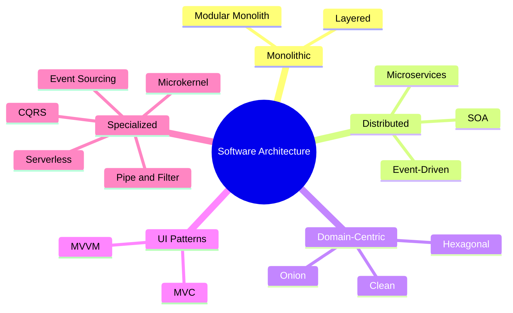

---

# 1. Layered Architecture (N-Tier)

## Structure

- Presentation Layer
- Business Logic Layer
- Data Access Layer
- Database Layer

### Advantages

- Easy to understand
- Clear separation
- Good for CRUD systems

### Disadvantages

- Tight coupling over time
- Performance overhead

---

# Layered Architecture Diagram

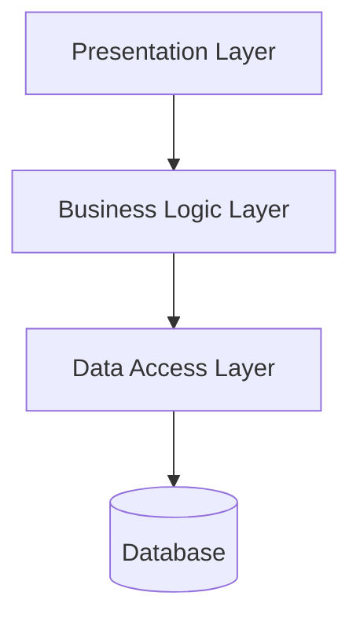

---

# 2. Monolithic Architecture

Entire application deployed as one unit.

### Characteristics

- Single codebase
- Single deployment artifact
- Shared database

### Best For

- MVPs
- Small teams
- Early-stage startups

---

# Monolithic Architecture Diagram

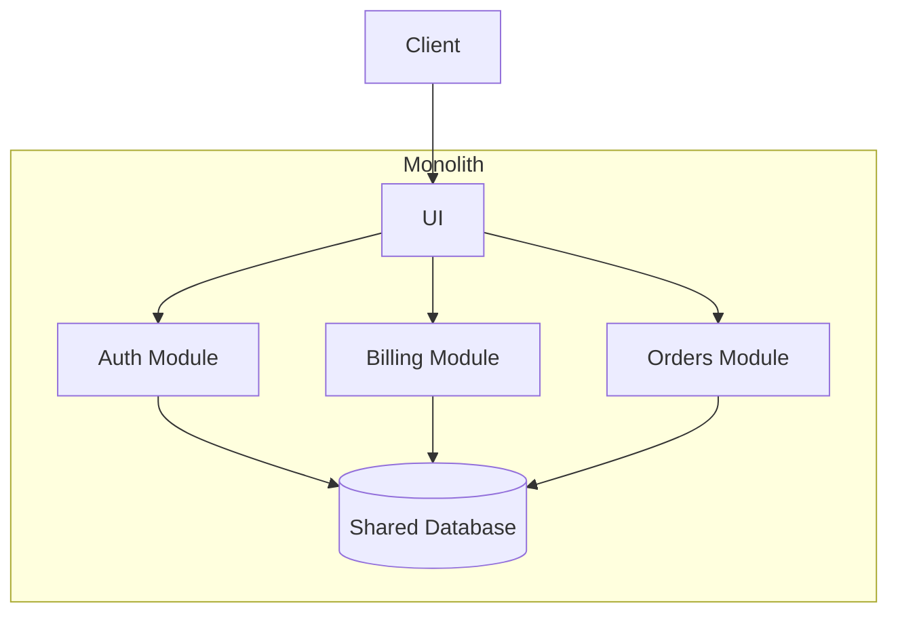

---

# 3. Microservices Architecture

Application split into independently deployable services.

### Characteristics

- Independent scaling
- Independent deployments
- Service ownership

### Challenges

- Distributed complexity
- Observability
- Network latency

---

# Microservices Diagram

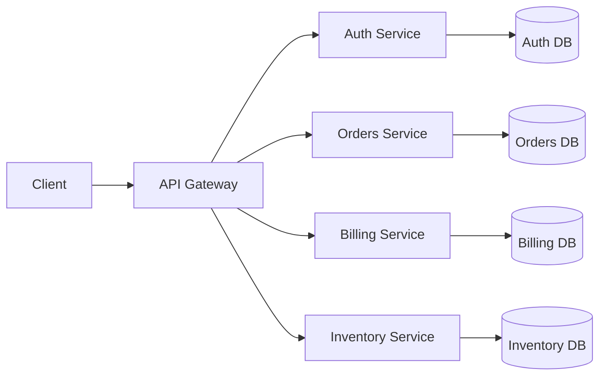

---

# 4. Service-Oriented Architecture (SOA)

Enterprise integration-focused architecture.

### Characteristics

- Enterprise Service Bus (ESB)
- Shared enterprise services
- Heavy governance

---

# SOA Diagram

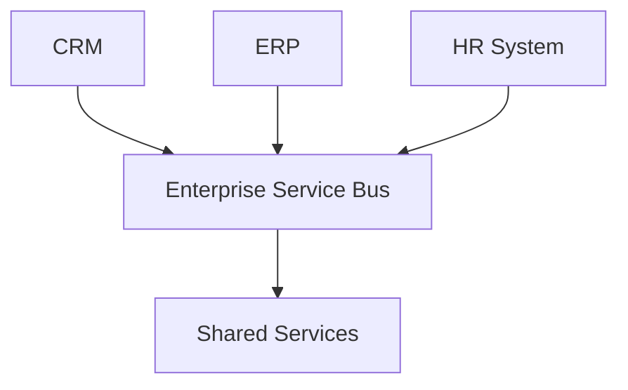

---

# 5. Event-Driven Architecture

Systems communicate through asynchronous events.

### Technologies

- Kafka
- RabbitMQ
- Pulsar

### Benefits

- Scalability
- Loose coupling
- Real-time responsiveness

---

# Event-Driven Diagram

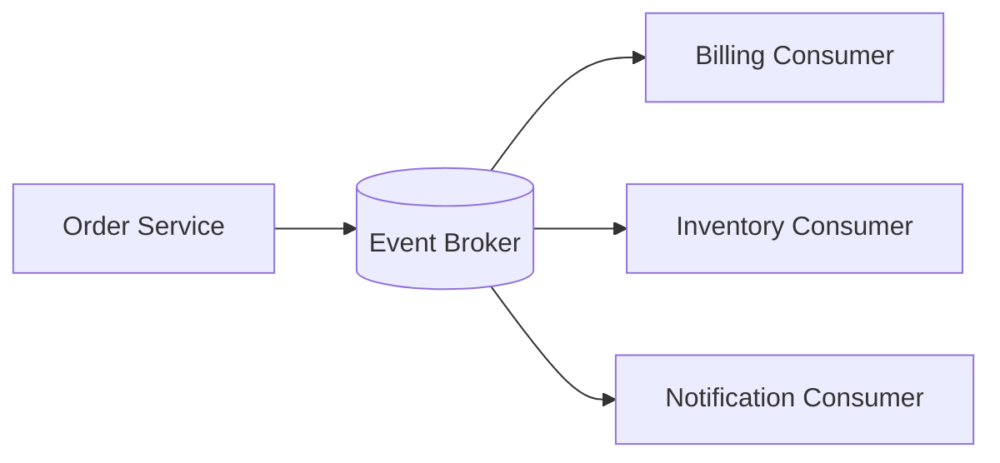

---

# 6. Hexagonal Architecture

Also called Ports and Adapters.

### Core Principle

Business logic isolated from infrastructure.

---

# Hexagonal Architecture Diagram

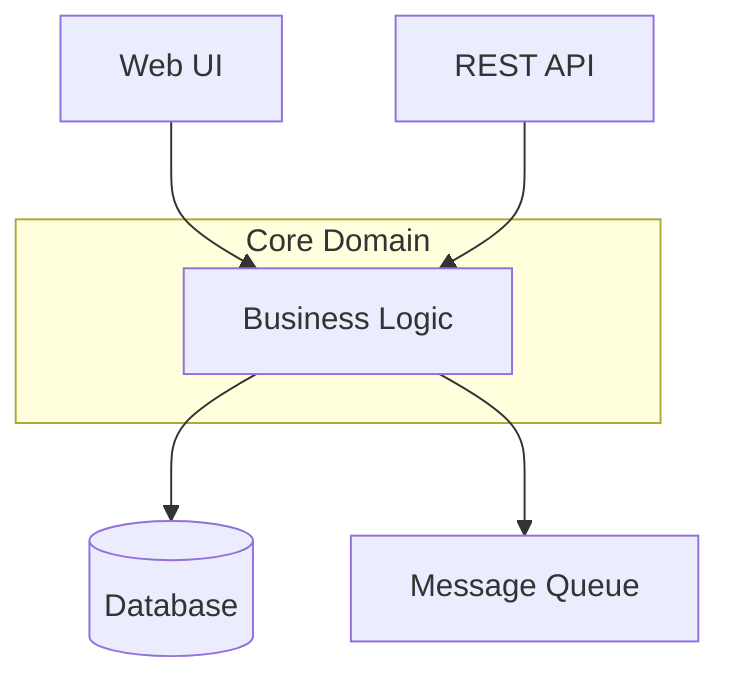

---

# 7. Clean Architecture

Dependencies point inward.

### Layers

- Entities
- Use Cases
- Interface Adapters
- Frameworks

---

# Clean Architecture Diagram

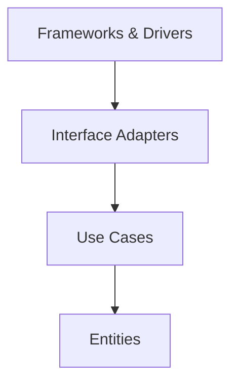

---

# 8. MVC Pattern

Separates UI responsibilities.

### Components

- Model
- View
- Controller

---

# MVC Diagram

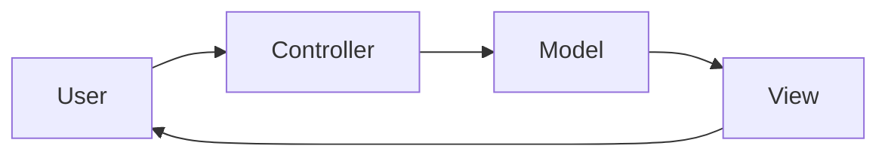

---

# 9. MVVM Pattern

Popular in frontend and mobile apps.

### Used In

- Angular
- SwiftUI
- WPF
- Android

---

# MVVM Diagram

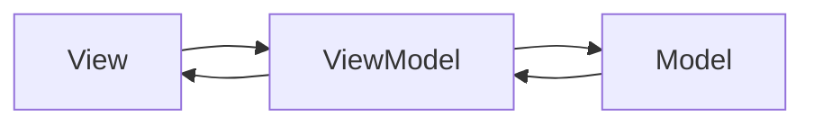

---

# 10. CQRS

Separate read and write models.

### Benefits

- Optimized scaling
- Flexible queries

### Drawbacks

- Complexity
- Synchronization overhead

---

# CQRS Diagram

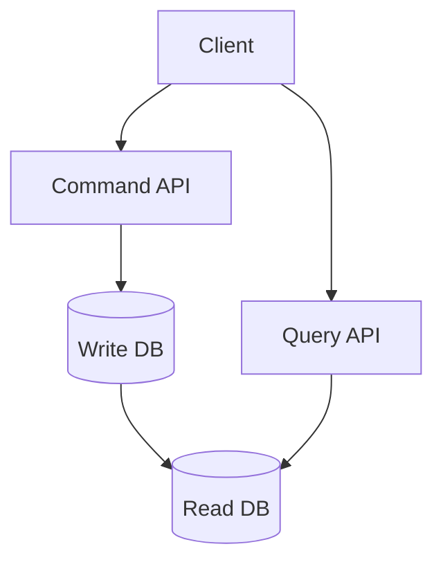

---

# 11. Event Sourcing

Store changes as immutable events.

### Example Events

- OrderCreated
- PaymentReceived
- ShipmentSent

---

# Event Sourcing Diagram

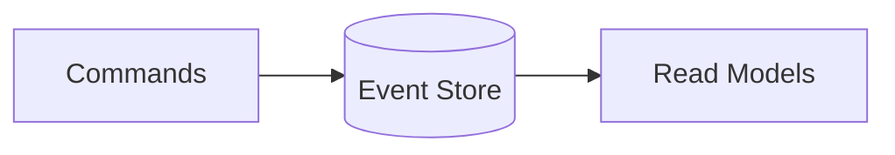

---

# 12. Serverless Architecture

Functions executed on demand.

### Platforms

- AWS Lambda
- Azure Functions
- Google Cloud Functions

---

# Serverless Diagram

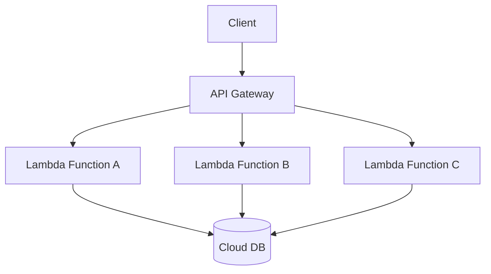

---

# 13. Modular Monolith

Structured monolith with strong module boundaries.

### Advantages

- Simpler than microservices
- Better maintainability
- Easier migration path

---

# Modular Monolith Diagram

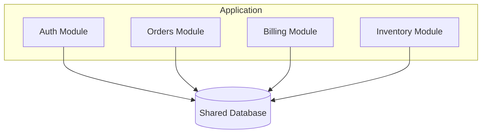

---

# 14. Microkernel / Plugin Architecture

Core system extended via plugins.

### Examples

- VS Code
- WordPress
- Eclipse

---

# Plugin Architecture Diagram

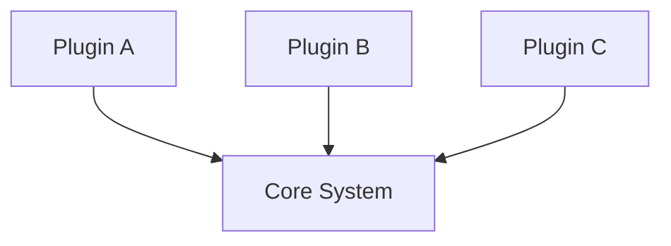

---

# 15. Pipe-and-Filter Architecture

Data processed through sequential stages.

### Common Uses

- ETL pipelines
- Media processing
- Compilers

---

# Pipe-and-Filter Diagram

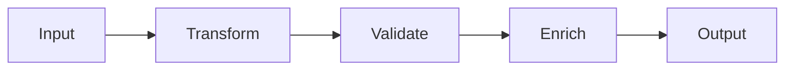

---

# Modern Architecture Evolution

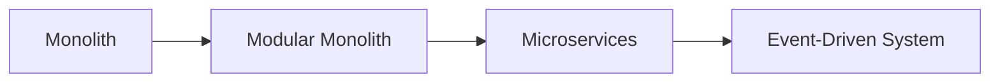

---

# Architecture Comparison Matrix

| Pattern | Complexity | Scalability | Team Size | Best For |
|---|---|---|---|---|
| Monolith | Low | Medium | Small | MVPs |
| Layered | Low | Medium | Small-Medium | CRUD apps |
| Modular Monolith | Medium | High | Medium | Growing products |
| Microservices | High | Very High | Large | Enterprise scale |
| Event-Driven | High | Very High | Large | Real-time systems |
| Clean/Hexagonal | Medium | High | Medium | Complex domains |
| Serverless | Medium | Auto | Small-Medium | Event workloads |

---

# Recommended Architecture Journey

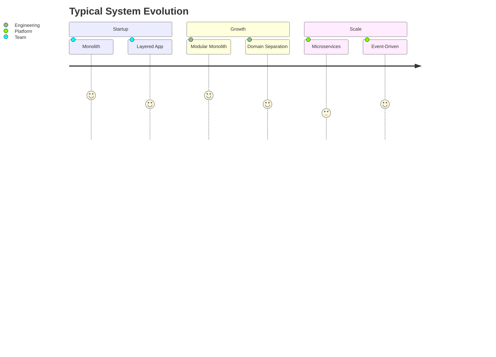

---

# Choosing the Right Architecture

Consider:

- Team size
- Deployment frequency
- Scalability requirements
- Operational maturity
- Business complexity
- Domain boundaries
- Budget and infrastructure

---

# Key Takeaways

- No architecture is universally best
- Simplicity wins early
- Complexity should be earned
- Modular monoliths are often underrated
- Microservices solve organizational scaling more than technical scaling
- Event-driven systems require operational maturity

---

# Final Thought

> "Architecture is the set of decisions you wish you could get right early."

---

# Thank You

Questions?
