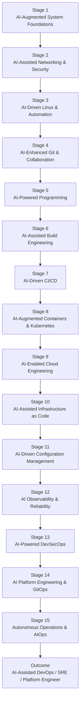
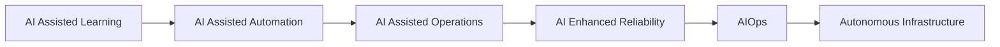

# AI-Assisted DevOps Learning Journey Map

---

# Stage 1 — AI-Augmented System Foundations

## AI-Assisted Learning Objectives

* Use AI copilots to accelerate Linux and OS learning
* Learn prompt engineering for infrastructure troubleshooting
* Build foundational operational reasoning using AI explanations

## Topics

* Linux fundamentals
* Terminal navigation
* File systems
* Process management
* System services
* AI-assisted command explanation
* Prompt engineering basics for DevOps

## AI-Assisted Tools

| Category       | Tools                                                                        |
| -------------- | ---------------------------------------------------------------------------- |
| AI Assistant   | OpenAI ChatGPT                                                               |
| IDE Copilot    | [GitHub Copilot](https://github.com/features/copilot?utm_source=chatgpt.com) |
| Linux Learning | [ExplainShell](https://explainshell.com?utm_source=chatgpt.com)              |
| Terminal AI    | [Warp Terminal](https://www.warp.dev?utm_source=chatgpt.com)                 |

## AI Use Cases

* Explain Linux commands
* Generate shell commands
* Troubleshoot permission issues
* Generate system diagrams

---

# Stage 2 — AI-Assisted Networking & Security

## AI-Assisted Learning Objectives

* Use AI to analyze networking configurations
* Learn AI-supported troubleshooting workflows
* Apply AI for security diagnostics

## Topics

* DNS troubleshooting
* HTTP/HTTPS
* TLS/SSL
* Reverse proxy
* Load balancing
* Firewall analysis
* AI-driven packet interpretation

## AI-Assisted Tools

| Area          | Tools                                                                                                                                                 |
| ------------- | ----------------------------------------------------------------------------------------------------------------------------------------------------- |
| Security AI   | [Microsoft Security Copilot](https://www.microsoft.com/en-us/security/business/ai-machine-learning/microsoft-security-copilot?utm_source=chatgpt.com) |
| Networking AI | [Wireshark AI Plugins](https://www.wireshark.org?utm_source=chatgpt.com)                                                                              |
| AI Assistant  | [Claude AI](https://claude.ai?utm_source=chatgpt.com)                                                                                                 |

## AI Use Cases

* Explain packet captures
* Generate NGINX configs
* Detect security misconfigurations
* Summarize vulnerability reports

---

# Stage 3 — AI-Driven Linux & Automation

## AI-Assisted Learning Objectives

* Automate infrastructure tasks with AI-generated scripts
* Learn AI-assisted scripting validation
* Improve operational efficiency with copilots

## Topics

* Bash scripting
* Shell pipelines
* Cron automation
* Log parsing
* AI-generated automation scripts
* AI-assisted troubleshooting

## AI-Assisted Tools

| Category      | Tools                                                                               |
| ------------- | ----------------------------------------------------------------------------------- |
| Code Copilot  | [Amazon Q Developer](https://aws.amazon.com/q/developer/?utm_source=chatgpt.com)    |
| Shell AI      | [Shell Genie](https://github.com/dylanjcastillo/shell-genie?utm_source=chatgpt.com) |
| Automation AI | [Aider AI](https://aider.chat?utm_source=chatgpt.com)                               |

## AI Use Cases

* Generate health-check scripts
* Convert manual procedures into automation
* Explain shell errors
* Optimize Linux commands

---

# Stage 4 — AI-Enhanced Git & Collaboration

## AI-Assisted Learning Objectives

* Use AI to improve code reviews and Git workflows
* Automate documentation generation
* Enhance collaboration efficiency

## Topics

* Git branching
* Pull requests
* Semantic commits
* AI-generated documentation
* AI-assisted code review

## AI-Assisted Tools

| Area             | Tools                                                                                                 |
| ---------------- | ----------------------------------------------------------------------------------------------------- |
| Code Review AI   | [CodeRabbit AI](https://coderabbit.ai?utm_source=chatgpt.com)                                         |
| Git Assistant    | [GitHub Copilot Workspace](https://githubnext.com/projects/copilot-workspace/?utm_source=chatgpt.com) |
| Documentation AI | [Mintlify AI Docs Writer](https://mintlify.com?utm_source=chatgpt.com)                                |

## AI Use Cases

* Auto-generate commit messages
* AI pull request review
* Detect risky changes
* Generate README documentation

---

# Stage 5 — AI-Powered Programming for Automation

## AI-Assisted Learning Objectives

* Accelerate automation development using AI copilots
* Learn infrastructure-focused coding patterns
* Build AI-assisted operational tooling

## Topics

* Python automation
* Go for cloud-native tooling
* REST APIs
* AI-assisted API integration
* Infrastructure SDKs

## AI-Assisted Tools

| Category         | Tools                                                                            |
| ---------------- | -------------------------------------------------------------------------------- |
| AI Coding        | [Cursor AI Editor](https://cursor.com?utm_source=chatgpt.com)                    |
| Pair Programming | [Replit Ghostwriter](https://replit.com/site/ghostwriter?utm_source=chatgpt.com) |
| Enterprise AI    | [JetBrains AI Assistant](https://www.jetbrains.com/ai/?utm_source=chatgpt.com)   |

## AI Use Cases

* Generate deployment scripts
* Refactor infrastructure code
* Generate API integrations
* Explain code architecture

---

# Stage 6 — AI-Assisted Build Engineering

## AI-Assisted Learning Objectives

* Use AI to optimize build pipelines
* Detect dependency vulnerabilities automatically
* Improve artifact lifecycle management

## Topics

* Dependency management
* Build systems
* Artifact repositories
* AI dependency analysis
* Build optimization

## AI-Assisted Tools

| Area            | Tools                                                                         |
| --------------- | ----------------------------------------------------------------------------- |
| Dependency AI   | [Dependabot](https://github.com/dependabot?utm_source=chatgpt.com)            |
| Security AI     | [Snyk AI Fixes](https://snyk.io/product/snyk-code/?utm_source=chatgpt.com)    |
| CI Optimization | [Launchable AI Testing](https://www.launchableinc.com?utm_source=chatgpt.com) |

## AI Use Cases

* Predict failing builds
* Optimize test execution
* Auto-fix dependency vulnerabilities
* Generate package upgrade recommendations

---

# Stage 7 — AI-Driven CI/CD Engineering

## AI-Assisted Learning Objectives

* Build intelligent delivery pipelines
* Apply AI-driven deployment validation
* Automate release engineering

## Topics

* CI/CD pipelines
* Release orchestration
* AI-assisted rollback analysis
* Deployment prediction
* Progressive delivery

## AI-Assisted Tools

| Area        | Tools                                                                                            |
| ----------- | ------------------------------------------------------------------------------------------------ |
| AI CI/CD    | [Harness AI DevOps Platform](https://www.harness.io?utm_source=chatgpt.com)                      |
| Pipeline AI | [GitHub Actions Copilot Integration](https://github.com/features/actions?utm_source=chatgpt.com) |
| Delivery AI | [Spinnaker Kayenta](https://spinnaker.io?utm_source=chatgpt.com)                                 |

## AI Use Cases

* Generate pipelines automatically
* Detect risky deployments
* Recommend rollback decisions
* Predict deployment failures

---

# Stage 8 — AI-Augmented Containers & Kubernetes

## AI-Assisted Learning Objectives

* Use AI to manage Kubernetes complexity
* Automate cluster diagnostics
* Improve container orchestration operations

## Topics

* Docker
* Kubernetes
* Helm
* Cluster networking
* AI-assisted Kubernetes troubleshooting
* AI-powered YAML generation

## AI-Assisted Tools

| Area               | Tools                                                      |
| ------------------ | ---------------------------------------------------------- |
| Kubernetes AI      | [K8sgpt](https://k8sgpt.ai?utm_source=chatgpt.com)         |
| Cluster Management | [Lens Desktop](https://k8slens.dev?utm_source=chatgpt.com) |
| AI YAML            | [Monokle AI](https://monokle.io?utm_source=chatgpt.com)    |

## AI Use Cases

* Diagnose pod failures
* Generate Helm charts
* Explain Kubernetes events
* Detect cluster anomalies

---

# Stage 9 — AI-Enabled Cloud Engineering

## AI-Assisted Learning Objectives

* Use AI to optimize cloud infrastructure
* Improve cloud governance using AI
* Apply AI-driven cloud cost analysis

## Topics

* AWS/Azure/GCP
* IAM
* Networking
* Serverless
* AI cloud optimization
* FinOps intelligence

## AI-Assisted Tools

| Area     | Tools                                                                                                     |
| -------- | --------------------------------------------------------------------------------------------------------- |
| AWS AI   | [Amazon Q](https://aws.amazon.com/q/?utm_source=chatgpt.com)                                              |
| Azure AI | [Microsoft Copilot for Azure](https://azure.microsoft.com/en-us/products/copilot/?utm_source=chatgpt.com) |
| GCP AI   | [Google Gemini Cloud Assist](https://cloud.google.com/products/gemini?utm_source=chatgpt.com)             |

## AI Use Cases

* Optimize cloud costs
* Generate IAM policies
* Detect cloud drift
* Recommend architecture improvements

---

# Stage 10 — AI-Assisted Infrastructure as Code

## AI-Assisted Learning Objectives

* Generate IaC using natural language
* Improve infrastructure consistency with AI
* Automate Terraform troubleshooting

## Topics

* Terraform
* Pulumi
* OpenTofu
* State management
* AI-generated infrastructure templates

## AI-Assisted Tools

| Area         | Tools                                                                                              |
| ------------ | -------------------------------------------------------------------------------------------------- |
| Terraform AI | [Terraform Cloud AI Features](https://www.hashicorp.com/products/terraform?utm_source=chatgpt.com) |
| IaC Security | [Bridgecrew Prisma Cloud AI](https://www.prismacloud.io?utm_source=chatgpt.com)                    |
| IaC Copilot  | [Firefly AI for Cloud Assets](https://www.firefly.ai?utm_source=chatgpt.com)                       |

## AI Use Cases

* Generate Terraform modules
* Detect configuration drift
* Explain Terraform plans
* Auto-remediate IaC issues

---

# Stage 11 — AI-Driven Configuration Management

## AI-Assisted Learning Objectives

* Automate server configuration generation
* Use AI to validate operational consistency
* Improve configuration governance

## Topics

* Ansible
* Chef
* Puppet
* Desired state management
* AI-assisted configuration validation

## AI-Assisted Tools

| Area          | Tools                                                                                                                             |
| ------------- | --------------------------------------------------------------------------------------------------------------------------------- |
| Automation AI | [Red Hat Ansible Lightspeed](https://www.redhat.com/en/technologies/management/ansible/ansible-lightspeed?utm_source=chatgpt.com) |
| AI Ops        | [Puppet AI Assistance](https://www.puppet.com?utm_source=chatgpt.com)                                                             |

## AI Use Cases

* Generate Ansible playbooks
* Detect configuration drift
* Recommend hardening improvements
* Explain automation failures

---

# Stage 12 — AI Observability & Reliability

## AI-Assisted Learning Objectives

* Use AI for anomaly detection and incident response
* Build predictive observability systems
* Improve operational reliability using AIOps

## Topics

* Metrics
* Logs
* Traces
* AIOps
* Predictive alerting
* Root cause analysis

## AI-Assisted Tools

| Area             | Tools                                                                                                    |
| ---------------- | -------------------------------------------------------------------------------------------------------- |
| Observability AI | [Datadog Watchdog AI](https://www.datadoghq.com/product/watchdog/?utm_source=chatgpt.com)                |
| AIOps            | [Dynatrace Davis AI](https://www.dynatrace.com/platform/artificial-intelligence/?utm_source=chatgpt.com) |
| Incident AI      | [New Relic Grok AI](https://newrelic.com/platform/grok?utm_source=chatgpt.com)                           |

## AI Use Cases

* Detect anomalies automatically
* Predict outages
* Perform AI-assisted root cause analysis
* Correlate logs and traces

---

# Stage 13 — AI-Powered DevSecOps

## AI-Assisted Learning Objectives

* Automate security scanning and remediation
* Use AI to strengthen supply chain security
* Improve security response times

## Topics

* SAST/DAST
* Secrets management
* Vulnerability scanning
* AI threat detection
* Compliance automation

## AI-Assisted Tools

| Area          | Tools                                                                                                 |
| ------------- | ----------------------------------------------------------------------------------------------------- |
| Security AI   | [Wiz AI Security Graph](https://www.wiz.io?utm_source=chatgpt.com)                                    |
| Code Security | [GitHub Advanced Security AI](https://github.com/security/advanced-security?utm_source=chatgpt.com)   |
| Threat AI     | [CrowdStrike Charlotte AI](https://www.crowdstrike.com/platform/charlotte-ai/?utm_source=chatgpt.com) |

## AI Use Cases

* Auto-remediate vulnerabilities
* Detect secrets leakage
* Generate compliance reports
* Prioritize security threats

---

# Stage 14 — AI Platform Engineering & GitOps

## AI-Assisted Learning Objectives

* Build AI-enabled internal developer platforms
* Improve self-service infrastructure
* Automate governance and compliance

## Topics

* GitOps
* Platform engineering
* Policy-as-code
* Developer portals
* AI-assisted workflows

## AI-Assisted Tools

| Area        | Tools                                                                                       |
| ----------- | ------------------------------------------------------------------------------------------- |
| Platform AI | [Backstage Plugins AI](https://backstage.io?utm_source=chatgpt.com)                         |
| GitOps AI   | [ArgoCD AI Extensions](https://argo-cd.readthedocs.io?utm_source=chatgpt.com)               |
| Policy AI   | [Open Policy Agent AI Integrations](https://www.openpolicyagent.org?utm_source=chatgpt.com) |

## AI Use Cases

* Generate deployment policies
* Automate developer onboarding
* Build AI-powered self-service platforms
* Detect governance violations

---

# Stage 15 — Autonomous Operations & AIOps

## AI-Assisted Learning Objectives

* Build self-healing operational systems
* Implement autonomous incident response
* Operate AI-driven production systems

## Topics

* AIOps
* Autonomous remediation
* Chaos engineering
* Predictive scaling
* AI operations governance

## AI-Assisted Tools

| Area           | Tools                                                                                |
| -------------- | ------------------------------------------------------------------------------------ |
| Autonomous Ops | [Moogsoft AIOps](https://www.moogsoft.com?utm_source=chatgpt.com)                    |
| Incident AI    | [PagerDuty AI Ops](https://www.pagerduty.com/platform/aiops/?utm_source=chatgpt.com) |
| Reliability AI | [IBM Watson AIOps](https://www.ibm.com/products/watson-aiops?utm_source=chatgpt.com) |

## AI Use Cases

* Self-healing infrastructure
* AI-generated incident response
* Predictive scaling
* Automated operational decisions

---

# AI Capability Maturity Journey

---

# Final Target Skills

By completing this AI-infused roadmap, learners develop competency in:

| Capability                  | Outcome                    |
| --------------------------- | -------------------------- |
| AI-Augmented Engineering    | Faster delivery            |
| Intelligent Automation      | Reduced manual operations  |
| AI-Assisted Troubleshooting | Faster incident resolution |
| Predictive Operations       | Improved uptime            |
| Autonomous Infrastructure   | Self-healing systems       |
| AI Governance               | Safer AI adoption          |
| Platform Engineering        | Developer productivity     |

---

# Recommended End-State Roles

* AI-Assisted DevOps Engineer
* Platform Engineer
* Cloud Automation Engineer
* AI Infrastructure Engineer
* AIOps Engineer
* DevSecOps Engineer
* Site Reliability Engineer (SRE)
* MLOps Engineer
