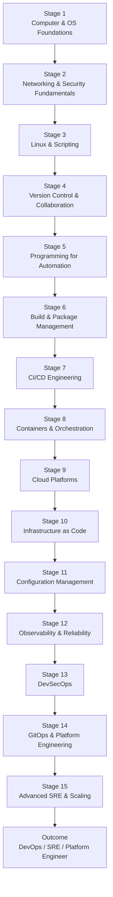

A structured DevOps learning journey should move from **foundational systems knowledge** → **automation and infrastructure** → **cloud-native operations** → **production engineering and platform maturity**. The [roadmap.sh DevOps Roadmap](https://roadmap.sh/devops?utm_source=chatgpt.com) organizes these topics into a practical progression for becoming a DevOps Engineer, SRE, or Platform Engineer. ([roadmap.sh][1])

# DevOps Learning Journey Map

---

# Stage 1 — Computer & Operating System Foundations

## Learning Objectives

* Understand how operating systems work
* Learn process management, memory, storage, permissions
* Build terminal confidence

## Topics

* Operating systems concepts
* Linux distributions
* File systems
* Processes and services
* Users/groups/permissions
* Package managers

## Recommended Tools

* Ubuntu
* WSL2
* VirtualBox
* VMware

## Deliverables

* Install Linux locally
* Configure SSH access
* Create shell aliases and environment variables

---

# Stage 2 — Networking & Security Fundamentals

Networking is heavily emphasized in real-world DevOps operations and often under-learned by beginners. ([Reddit][2])

## Learning Objectives

* Understand application communication
* Troubleshoot network and DNS issues

## Topics

* TCP/IP
* DNS
* HTTP/HTTPS
* Reverse proxy
* Load balancers
* SSL/TLS
* Firewalls
* VPN basics

## Tools

* `curl`
* `dig`
* `netstat`
* `tcpdump`
* `nginx`
* `openssl`

## Projects

* Configure NGINX reverse proxy
* Generate self-signed TLS certificates
* Analyze network traffic

---

# Stage 3 — Linux & Scripting

Linux proficiency is considered a core DevOps skill. ([roadmap.sh][3])

## Learning Objectives

* Automate repetitive operational tasks
* Operate entirely from terminal

## Topics

* Bash scripting
* Shell pipelines
* Cron jobs
* Log analysis
* System monitoring
* Service management (`systemd`)

## Tools

* Bash
* awk/sed/grep
* systemctl
* journalctl

## Projects

* Automated backup script
* Server health-check script
* Disk cleanup automation

---

# Stage 4 — Version Control & Collaboration

## Learning Objectives

* Work in collaborative engineering workflows
* Understand GitOps foundations

## Topics

* Git workflows
* Branching strategies
* Pull requests
* Merge conflicts
* Semantic commits

## Platforms

* [GitHub](https://github.com?utm_source=chatgpt.com)
* [GitLab](https://gitlab.com?utm_source=chatgpt.com)
* [Bitbucket](https://bitbucket.org?utm_source=chatgpt.com)

## Projects

* Multi-branch workflow
* Git hooks
* CI-triggered commits

---

# Stage 5 — Programming for Automation

Roadmap.sh recommends learning at least one automation language such as Python or Go. ([GitHub][4])

## Recommended Languages

| Purpose              | Recommended        |
| -------------------- | ------------------ |
| Automation           | Python             |
| Cloud-native tooling | Go                 |
| CI/CD scripting      | Bash               |
| APIs & tooling       | JavaScript/Node.js |

## Learning Objectives

* Build operational tooling
* Automate infrastructure tasks
* Work with APIs

## Projects

* Deployment automation scripts
* REST API monitoring tool
* Infrastructure audit scripts

---

# Stage 6 — Build & Package Management

## Learning Objectives

* Understand software build lifecycle
* Manage dependencies and artifacts

## Topics

* Package managers
* Build systems
* Artifact repositories
* Semantic versioning

## Tools

* Maven
* Gradle
* npm
* pip
* Artifactory
* Nexus

---

# Stage 7 — CI/CD Engineering

CI/CD is foundational to modern DevOps practice. ([roadmap.sh][3])

## Learning Objectives

* Automate testing and deployments
* Create delivery pipelines

## Topics

* Continuous Integration
* Continuous Delivery
* Pipeline stages
* Rollback strategies
* Blue/Green deployment
* Canary deployment

## Tools

* Jenkins
* GitHub Actions
* GitLab CI/CD
* Azure DevOps
* ArgoCD

## Projects

* End-to-end deployment pipeline
* Automated Docker image build
* Multi-environment deployment

---

# Stage 8 — Containers & Orchestration

Containers and Kubernetes are central DevOps competencies. ([roadmap.sh][3])

## Learning Objectives

* Package applications consistently
* Orchestrate distributed systems

## Topics

* Docker architecture
* Container networking
* Kubernetes primitives
* Helm charts
* Service mesh basics

## Tools

* Docker
* Kubernetes
* Helm
* K3s
* Minikube

## Projects

* Containerize full-stack application
* Deploy Kubernetes cluster
* Helm-based deployments

---

# Stage 9 — Cloud Platforms

## Learning Objectives

* Operate infrastructure at scale
* Understand managed cloud services

## Recommended Cloud

| Beginner | Enterprise |
| -------- | ---------- |
| AWS      | AWS        |
| Azure    | Azure      |
| GCP      | GCP        |

## Core Topics

* Compute
* Networking
* IAM
* Storage
* Kubernetes services
* Serverless

## Certifications (Optional)

* AWS Solutions Architect Associate
* Azure Administrator
* Google Associate Cloud Engineer

---

# Stage 10 — Infrastructure as Code (IaC)

IaC is a core DevOps discipline. ([roadmap.sh][5])

## Learning Objectives

* Provision infrastructure programmatically
* Eliminate manual infrastructure changes

## Tools

* Terraform
* Pulumi
* AWS CDK
* OpenTofu

## Topics

* State management
* Modules
* Reusable infrastructure
* Drift detection

## Projects

* Full cloud environment provisioning
* Multi-region deployment
* Kubernetes provisioning via Terraform

---

# Stage 11 — Configuration Management

## Learning Objectives

* Standardize server configuration
* Enforce consistency

## Tools

* Ansible
* Chef
* Puppet
* SaltStack

## Projects

* Automated server provisioning
* Harden Linux systems
* Install application stacks automatically

---

# Stage 12 — Observability & Reliability

Monitoring and observability are essential operational skills. ([roadmap.sh][3])

## Learning Objectives

* Detect incidents quickly
* Measure system health

## Topics

* Metrics
* Logs
* Traces
* Alerting
* SLI/SLO/SLA

## Tools

* Prometheus
* Grafana
* Loki
* ELK Stack
* OpenTelemetry

## Projects

* Centralized logging platform
* Full observability dashboard
* Kubernetes monitoring stack

---

# Stage 13 — DevSecOps

## Learning Objectives

* Shift security left
* Secure CI/CD and infrastructure

## Topics

* Secrets management
* Container scanning
* SAST/DAST
* IAM hardening
* Supply chain security

## Tools

* Vault
* Trivy
* Snyk
* SonarQube
* OWASP ZAP

---

# Stage 14 — GitOps & Platform Engineering

## Learning Objectives

* Build self-service engineering platforms
* Automate operations declaratively

## Topics

* GitOps workflows
* Internal developer platforms
* Policy-as-code
* Kubernetes operators

## Tools

* ArgoCD
* FluxCD
* Backstage
* Crossplane

---

# Stage 15 — Advanced SRE & Scaling

## Learning Objectives

* Operate highly available distributed systems
* Improve reliability engineering maturity

## Topics

* Incident response
* Chaos engineering
* Capacity planning
* Multi-region architecture
* Performance optimization

## Tools

* PagerDuty
* Chaos Mesh
* Istio
* Envoy

---

# Recommended Learning Timeline

| Phase                | Duration   | Focus                             |
| -------------------- | ---------- | --------------------------------- |
| Foundation           | 1–2 months | Linux, networking, Git            |
| Automation           | 1–2 months | Bash, Python, CI/CD               |
| Cloud Native         | 2–3 months | Docker, Kubernetes, cloud         |
| Infrastructure       | 1–2 months | Terraform, Ansible                |
| Production Ops       | 1–2 months | Monitoring, security              |
| Advanced Engineering | Ongoing    | SRE, GitOps, Platform Engineering |

---

# Suggested Hands-On Portfolio Projects

## Beginner

* Linux automation toolkit
* Static website CI/CD
* Dockerized Node.js app

## Intermediate

* Kubernetes microservices deployment
* Terraform AWS infrastructure
* Monitoring dashboard stack

## Advanced

* GitOps deployment platform
* Multi-cloud deployment pipeline
* Self-healing Kubernetes infrastructure

---

# Recommended AI-Assisted DevOps Toolchain

Since modern DevOps increasingly integrates AI-assisted operations and automation, these tools complement the roadmap effectively:

| Area                 | AI-Assisted Tools                                                                      |
| -------------------- | -------------------------------------------------------------------------------------- |
| Coding               | [GitHub Copilot](https://github.com/features/copilot?utm_source=chatgpt.com)           |
| Infrastructure       | [Terraform Cloud](https://www.hashicorp.com/products/terraform?utm_source=chatgpt.com) |
| CI/CD                | [GitHub Actions](https://github.com/features/actions?utm_source=chatgpt.com)           |
| Kubernetes Ops       | [Lens](https://k8slens.dev?utm_source=chatgpt.com)                                     |
| Monitoring           | [Datadog](https://www.datadoghq.com?utm_source=chatgpt.com)                            |
| Security             | [Snyk](https://snyk.io?utm_source=chatgpt.com)                                         |
| Platform Engineering | [Backstage](https://backstage.io?utm_source=chatgpt.com)                               |

---

# Final Outcome

Following this learning journey prepares you for roles such as:

* DevOps Engineer
* Site Reliability Engineer (SRE)
* Platform Engineer
* Cloud Engineer
* Infrastructure Engineer
* DevSecOps Engineer
* MLOps Engineer

The roadmap is most effective when paired with:

1. Continuous hands-on projects
2. Real deployment experience
3. Cloud exposure
4. CI/CD implementation
5. Operational troubleshooting experience

The roadmap itself is community-driven and widely recommended as a strong overview for beginners and intermediates. ([Reddit][2])

[1]: https://roadmap.sh/devops?utm_source=chatgpt.com "Learn to become a DevOps Engineer or SRE"
[2]: https://www.reddit.com/r/devops/comments/11oj8ka/is_roadmapshs_devops_roadmap_good_for_beginners/?utm_source=chatgpt.com "Is Roadmap.sh's Devops Roadmap good for beginners?"
[3]: https://roadmap.sh/devops/skills?utm_source=chatgpt.com "10+ In-Demand DevOps Engineer Skills to Master"
[4]: https://github.com/milanm/DevOps-Roadmap?utm_source=chatgpt.com "DevOps Roadmap for 2026. with learning resources"
[5]: https://roadmap.sh/devops/how-to-become-devops-engineer?utm_source=chatgpt.com "How to become a DevOps Engineer in 2026"
