# Software Development Lifecycle

## From Ground Zero to Production

> *Nine phases — from the first conversation to a live, monitored production system.*

---

## End-to-End Flow

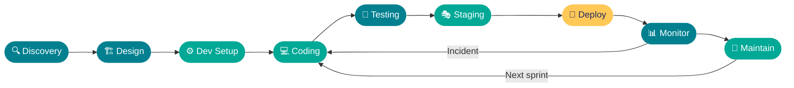

---

## Phase Overview

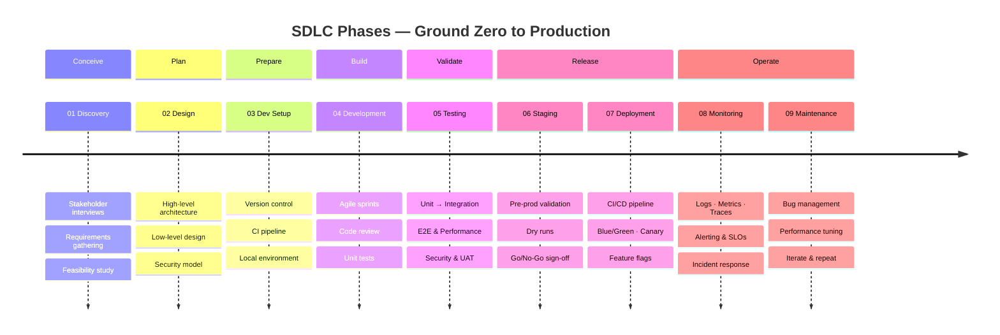

---

## 01 — Discovery & Requirements

> Define the problem before writing a single line of code.

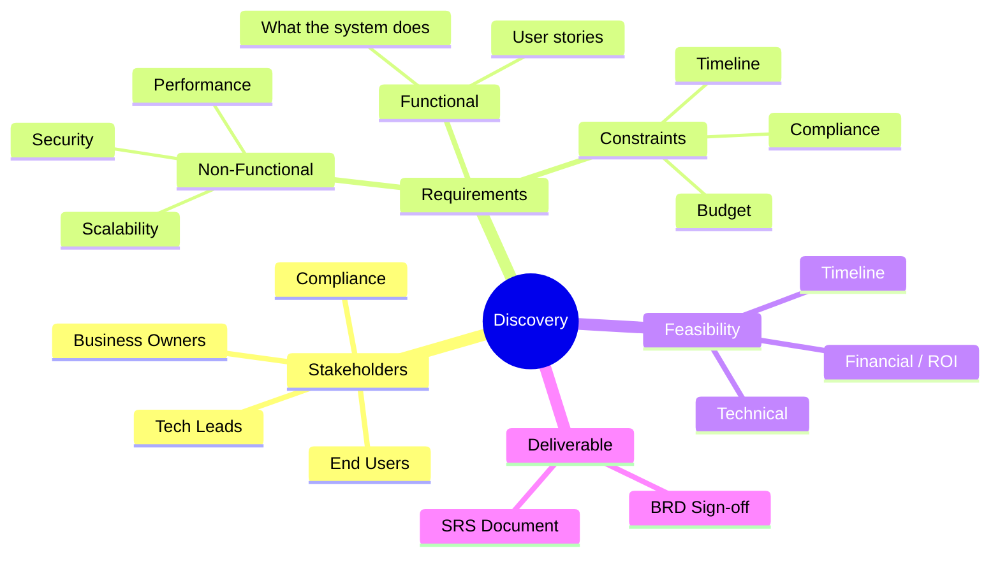

**Key outputs:**

- Business Requirements Document (BRD)
- Software Requirements Specification (SRS)
- Signed stakeholder approval

---

## 02 — System Design

> Blueprint the architecture before building.

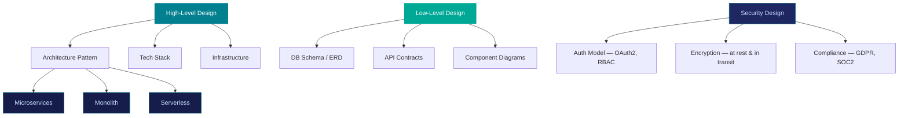

**Key outputs:**

- Architecture Decision Records (ADRs)
- API specs (OpenAPI / Swagger)
- Database schema

---

## 03 — Development Environment Setup

> Get every engineer productive from day one.

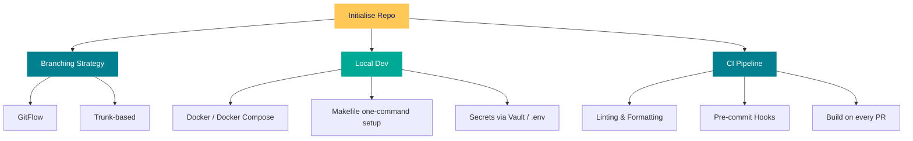

---

## 04 — Implementation (Coding)

> Building features iteratively with quality gates.

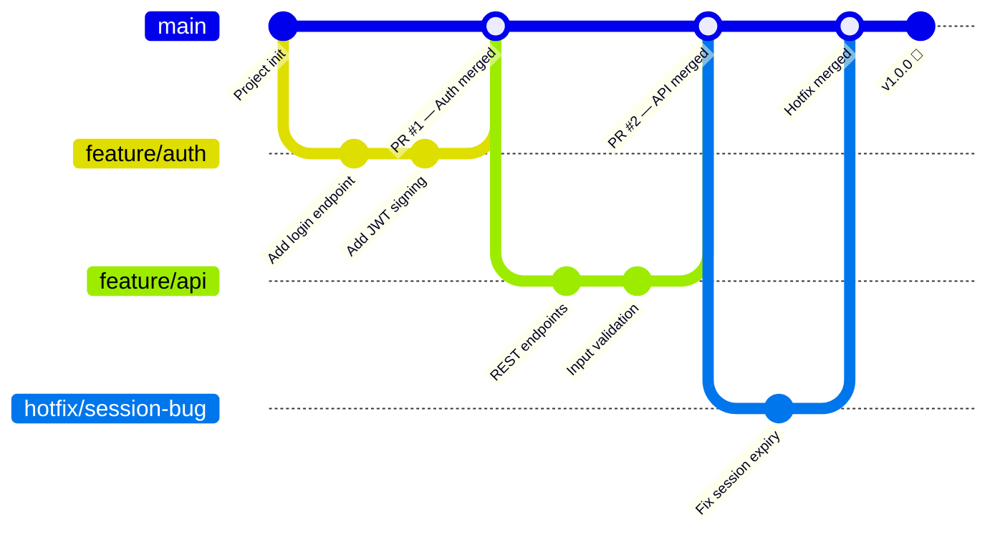

**Engineering practices:**

- Pull requests with mandatory peer review
- Test-driven development (TDD) encouraged
- Feature flags for safe continuous deployment
- Static analysis via SonarQube / Snyk / CodeQL
- SOLID principles and clean code conventions

---

## 05 — Testing Strategy

> Multiple layers of validation before production.

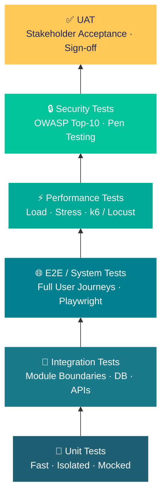

| Test Type | Purpose | Tools |
|---|---|---|
| Unit | Individual functions / components | Jest, pytest, JUnit |
| Integration | Module interactions, DB, queues | Supertest, Postman |
| E2E / System | Full user journeys | Playwright, Cypress |
| Performance | Load & stress testing | k6, Locust, JMeter |
| Security | OWASP, pen testing | OWASP ZAP, Burp Suite |
| UAT | Business acceptance | Manual / stakeholders |
| Regression | No new breakages introduced | CI automated suite |

> **Target:** ≥ 80% unit test coverage minimum.

---

## 06 — Staging & Pre-Production

> Production-mirror validation before go-live.

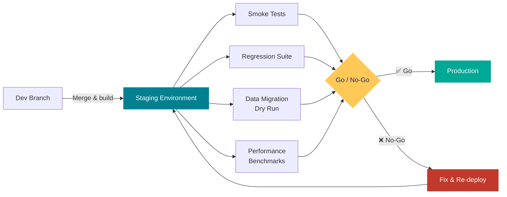

**Operational readiness checklist:**

- Runbook written — step-by-step deployment procedure
- Rollback plan documented and tested
- On-call schedule and escalation path confirmed
- Estimated downtime window calculated

---

## 07 — Deployment to Production

> Getting code live safely and confidently.

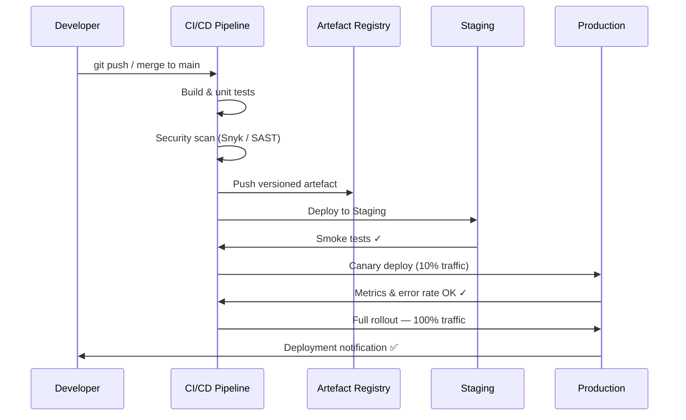

### Deployment Strategies Compared

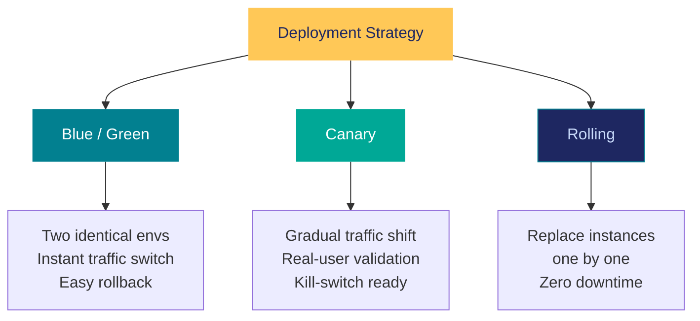

---

## 08 — Monitoring & Observability

> You can't improve what you can't measure.

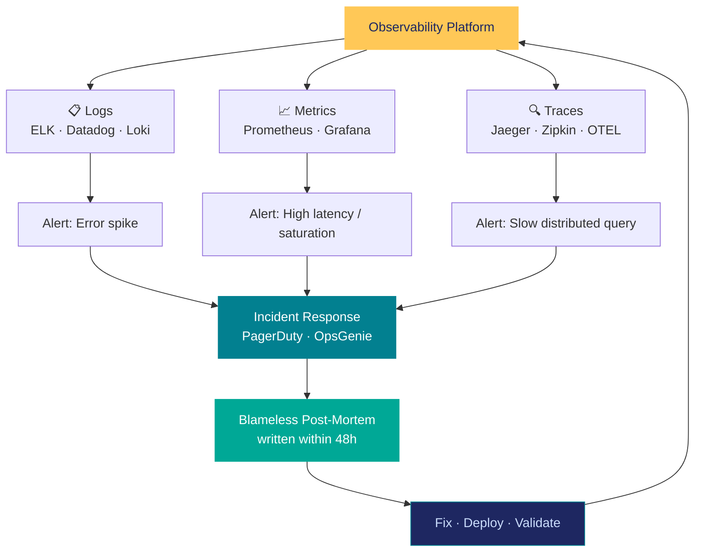

**The three pillars of observability:**

| Pillar | What it tells you | Example tools |
|---|---|---|
| **Logs** | What happened and when | ELK Stack, Datadog, Loki |
| **Metrics** | How the system is performing | Prometheus, Grafana, CloudWatch |
| **Traces** | Where time is spent across services | Jaeger, Zipkin, OpenTelemetry |

**SLO / SLA framework:**

- Define SLIs (Service Level Indicators) per service
- Set SLOs — e.g. 99.9% uptime, p99 latency < 500ms
- Error budgets balance reliability vs. release velocity

---

## 09 — Maintenance & Iteration

> Production is not the end — it is the beginning.

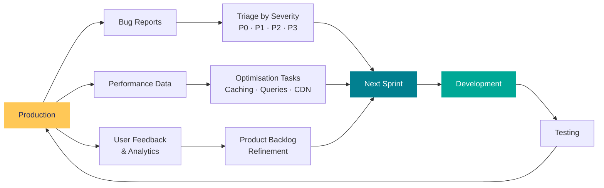

**Ongoing cadence:**

- Monthly dependency and security audits (Dependabot / Renovate)
- Quarterly major version upgrade planning
- DORA metrics review every sprint
- Team retrospectives — no exceptions

---

## Measuring Success — DORA Metrics

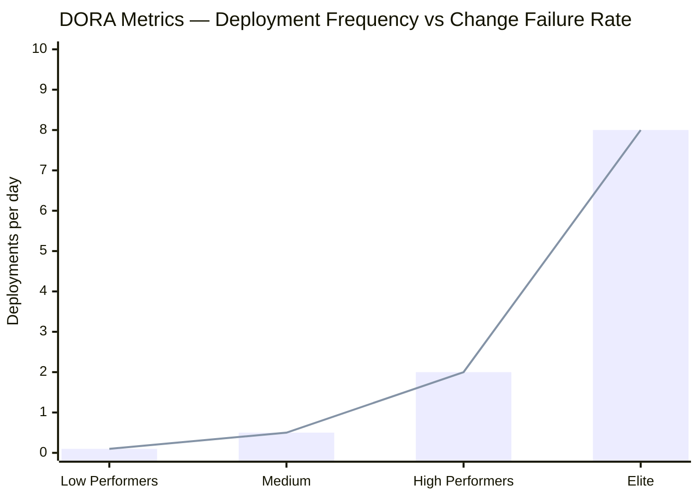

| Metric | Elite | High | Medium | Low |
|---|---|---|---|---|
| Deployment Frequency | Multiple/day | Weekly | Monthly | 6+ months |
| Lead Time for Change | < 1 hour | 1 day | 1 week | 1+ month |
| Change Failure Rate | < 5% | < 10% | 15–30% | 45–60% |
| MTTR (restore time) | < 1 hour | < 1 day | 1 day | 1 week |

---

## The Big Picture

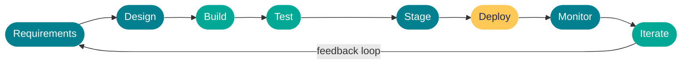

> **Automate everything between commit and production.**
> Ship fast. Fail safe. Learn continuously.
